**[English](README.md) | 日本語**

# Agent Sessions

[Claude Code](https://claude.com/claude-code)・[Codex](https://github.com/openai/codex)・[OpenCode](https://opencode.ai) を、ノートの隣のターミナルタブで動かす [Obsidian](https://obsidian.md) のプラグインです。すべてのセッションの状態とコスト、エージェントごとの利用枠を1つの一覧で見られます。

デスクトップ専用です。macOS、Linux、Windows で動きます。

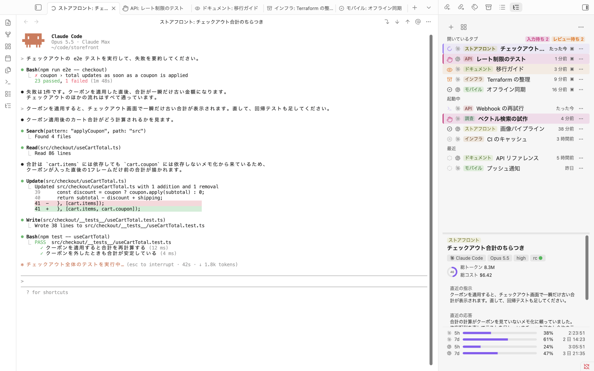

## 機能

### カテゴリ別のセッションと、利用状況とコスト

**セッションマネージャー** は、`カテゴリ: 名前` の形の名前でセッションをまとめ、5時間枠と7日枠のコストを示します。その下に、エージェントごとの利用枠、リセットまでの時間、今のペースで上限に届くかどうかが出ます。コストは、エージェントが残すファイルをもとに、このマシンの中で計算した推定値です。[詳しく](docs/usage.md#session-manager)

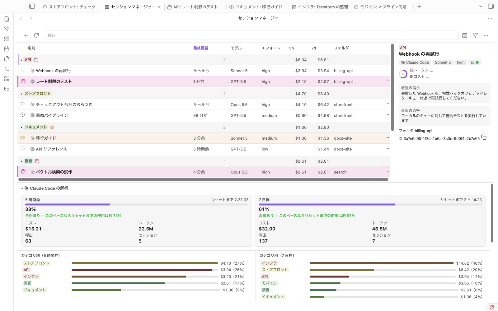

### どのエージェントでもセッションを開始

**新規セッション** で名前を入れます。複数のエージェントを有効にしていれば、どれを使うかも選びます。Claude Code・Codex・OpenCode のセッションは、同じ一覧に並びます。[詳しく](docs/usage.md#start-a-session)

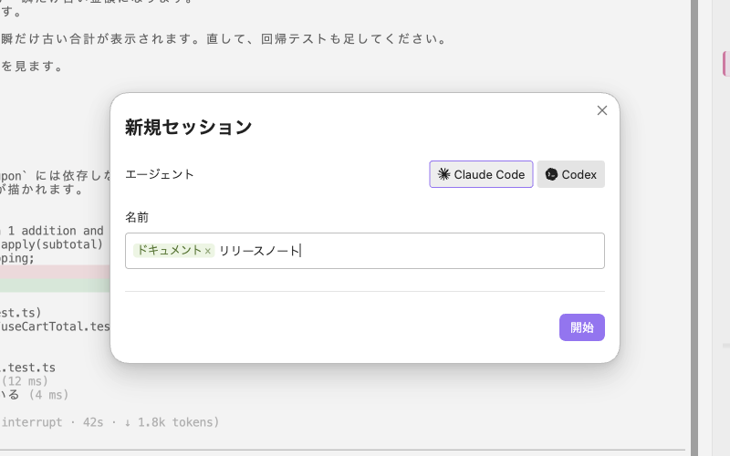

### エージェントの CLI をそのままタブで

各セッションでは、エージェントのコマンドラインプログラムそのものが Obsidian のタブで動きます。設定、ログイン、スラッシュコマンド、フック、スキル、MCP サーバーは、ターミナルと同じように使えます。出力に出た vault 内のパスは、リンクとして開けます。[詳しく](docs/usage.md#work-in-a-session-tab)

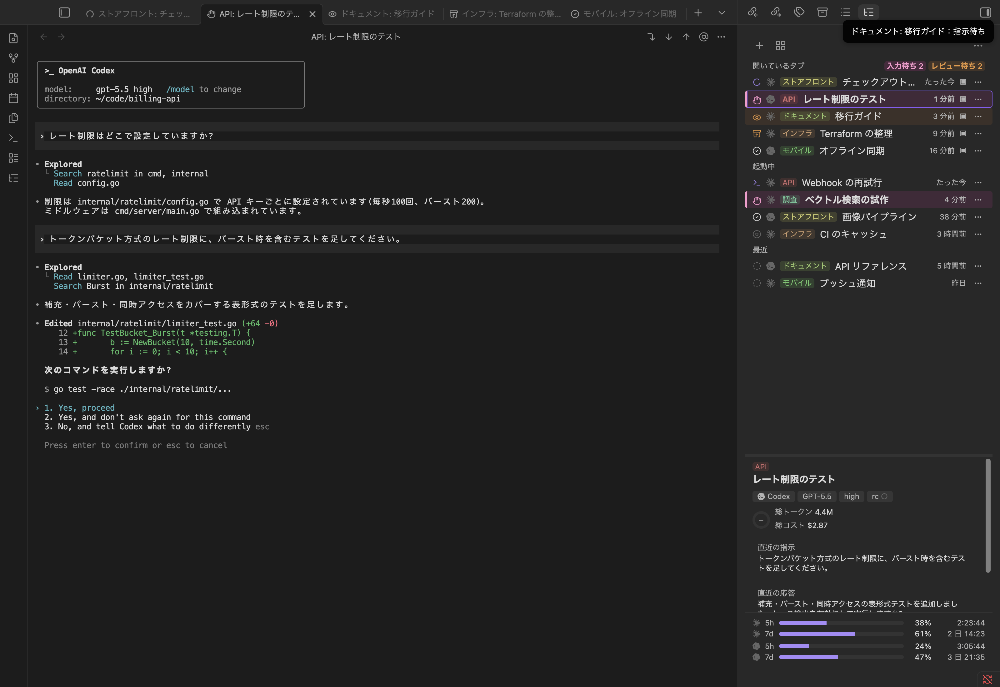

### サイドパネルでのセッションの切り替え

開いているタブ、タブのない起動中のセッション、最近のセッションを、状態のアイコンつきで並べます。Claude Code と Codex の `/goal` は、進行中と達成後（次のプロンプトまで）にもう1つのアイコンで示します。クリックすると、そのタブが前に出ます。タブがなければ、新しいタブで開きます。終了したセッションは、会話の続きから再開します。スケジュール実行（`/loop`、cron、wakeup）を持つ Claude Code のセッションにはスケジュールのバッジが付き、別の作業をしているあいだに予約実行が終わると、タブを開くまで行に印が付きます。一覧の下の詳細には、選んだセッションの状態と、その意味を一文で示します。タブを閉じても、Obsidian を終了しても、セッションは動き続けます。[詳しく](docs/usage.md#switch-between-sessions)

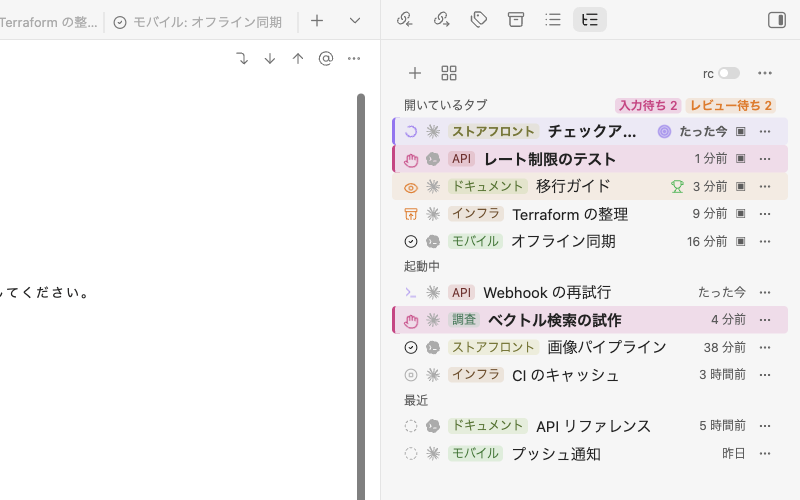

### claude.ai や Claude アプリからの Remote Control

サイドパネルの **rc** スイッチで、vault 用の Remote Control サーバーを 1 つ起動します。オンのあいだ、claude.ai や Claude アプリからこの vault で Claude Code のセッションを始められ、そのセッションはほかのセッションと同じようにサイドパネルに並びます。スイッチは既定でオフで、押したときだけオンになります。[ネットワーク](#ネットワーク)も見てください。⋯ メニューの **接続用のリンクをコピー** で、接続用のリンクをコピーできます。[詳しく](docs/usage.md#remote-control-server)

### プロンプトを書く内蔵エディタ

Ctrl+G で、ターミナルの下の枠にプロンプトを書けます。`@` でのファイル補完、ふつうの貼り付け、取り消し、IME での入力が使えます。出力は見えたままです。Claude Code では、モデルとエフォートもここで選べます。[詳しく](docs/usage.md#built-in-editor)

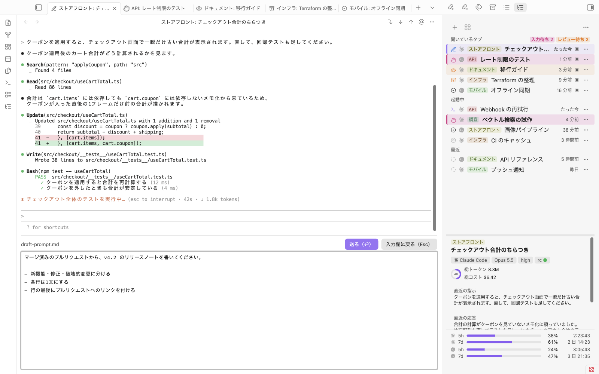

### 名前の変更とカテゴリ分け

各セッションには ⋯ メニューがあり、右クリックでも開きます。メニューの **名前を変更** で、セッションに名前を付けます。`ドキュメント: リリースノート` のような名前にすると「ドキュメント」カテゴリに入ります。カテゴリごとに色が付き、グループにまとまります。**カテゴリに移動…** は、カテゴリだけを変えます。[詳しく](docs/usage.md#name-and-group-sessions)

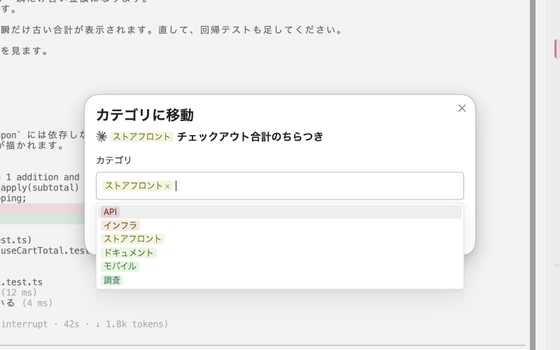

### エージェントによる名前とカテゴリの提案

**セッション名とカテゴリを整理** で、手元のエージェントが最近のセッションの名前とカテゴリを提案します。**選択を適用** を押すまで名前は変わりません。提案のため、セッションの抜粋をそのエージェントに送ります（[整理で送る内容](#整理で送る内容)）。[詳しく](docs/usage.md#organize-names-and-categories)

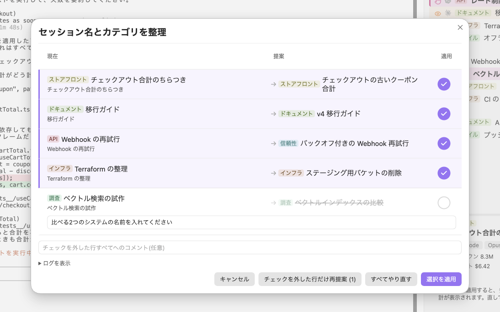

### セッションのメニューから圧縮・再起動・モデル変更

同じメニューの **セッションを圧縮** は、`/compact` を送ります。**セッションを再起動** は、変えた設定やスキルを読み込み直し、会話を続けます。Claude Code では **モデルを変更…** でモデルとエフォートを切り替えます。[詳しく](docs/usage.md#compact-restart-and-change-model)

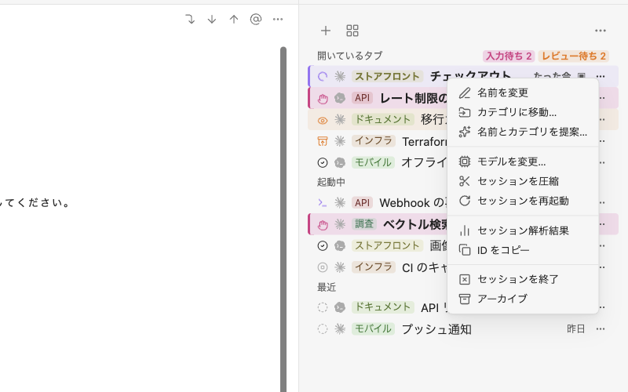

### トークンを減らせるところ

サイドパネルと Session Manager の ⋯ メニューの **利用枠を増やす…** は、利用枠をすぐに使い切ってしまうときに使います。直近の作業をエージェントに読ませ、トークンの無駄が無いかを 9 つの観点で調べます。同じ修正のくり返し、最初の依頼に必要な情報、1 つの会話に複数の作業、長すぎる会話、会話に残る大きな出力、キャッシュの作り直し、毎回同じ調べ物、会話の始めの読み込み、そしてこれらに当てはまらない、エージェントが見つけた無駄です。指摘ごとに、起きたこと・原因・次にすること・直すと減らせる量を示し、ファイルで直せる指摘は、エージェントに直してもらえます。そのセッションは plan モードで始まり、書く前に変更を見せます。統計はこのマシンの中で計算します。送る内容は [「利用枠を増やす」で送る内容](#利用枠を増やすで送る内容) にあります。[詳しく](docs/usage.md#stretch-your-usage-limit)

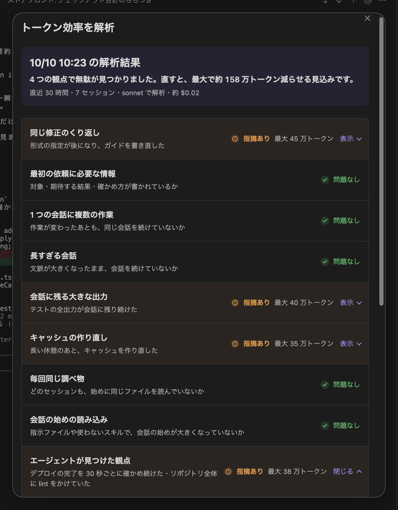

### ようこそガイドでの準備

初めてインストールすると、ようこそガイドが Python とエージェントを確かめます。補助プログラムが書き込む内容を示してからインストールし、最初のセッションまで案内します。[詳しく](docs/usage.md#welcome-guide)

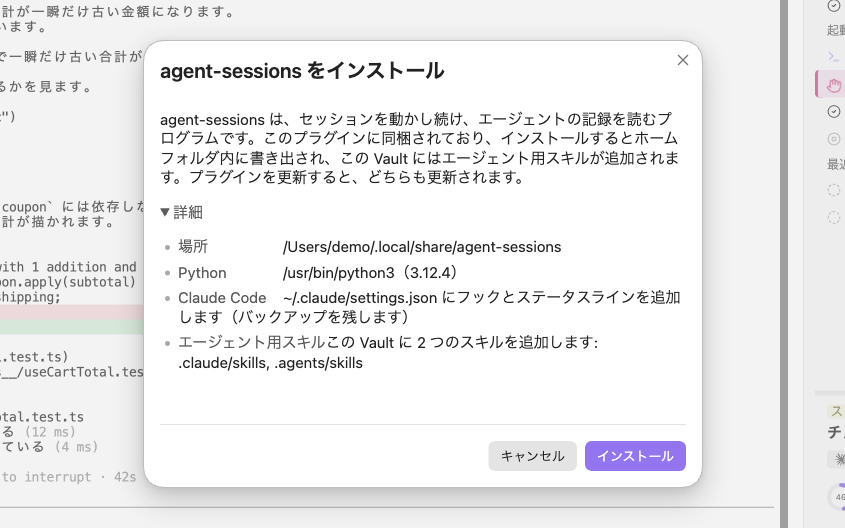

### セッションのコストをターンごとに

**セッション解析結果** は、1つのセッションのコスト、トークン数、ターン数、期間と、使ったツールを示します。プロンプトごとの入力・出力・コストも並びます。最初と最後の行をクリックすると、その範囲のターンだけを集計します。結果は Markdown でコピーできます。[詳しく](docs/usage.md#session-analytics)

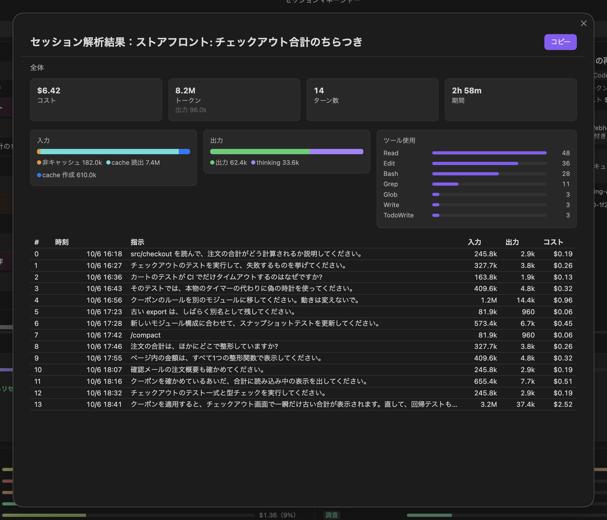

### いつ、どのエージェントが作業していたか

**稼働カレンダー** は、作業していた時間をブロックで示します。単位は7日枠・週・日から選べます。ブロックをクリックすると、その時間のプロンプトが並び、そこからセッションを開けます。[詳しく](docs/usage.md#activity-calendar)

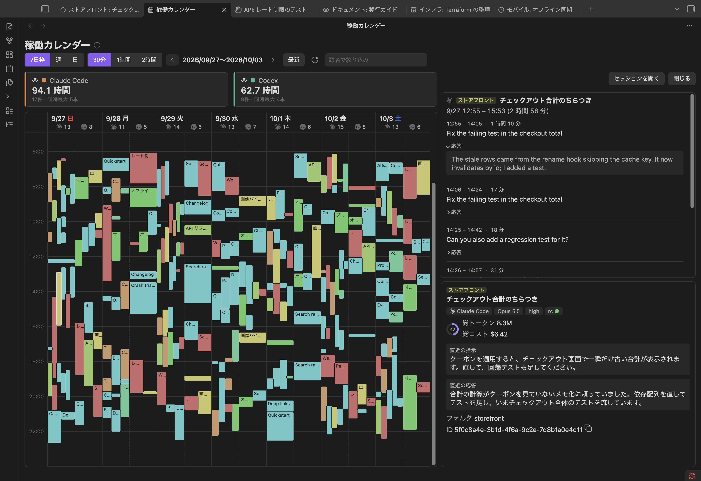

2つの[エージェントスキル](docs/usage.md#agent-skills)で、利用状況、ほかのセッション、プラグインの使い方も、エージェントに尋ねられます。すべての機能は [`docs/usage.md`](docs/usage.md) にあります。

**ないもの：** チャットパネル、ノートをその場で書き換える機能、Obsidian のモバイル版。OpenCode には利用枠がありません。OpenCode のサブエージェントのセッションと、`opencode run` で始めたセッションは一覧に出ません。

## 動作に必要なもの

- Obsidian 1.8.7 以降のデスクトップ版。
- Python 3.9 以降。セッションを動かし続ける補助プログラムに使います。追加のパッケージは要りません。
- インストール済みの Claude Code・Codex・OpenCode のどれか。

## 対応環境

| Obsidian | エージェント | 対応 |
|---|---|---|
| macOS | macOS | 対応 |
| Linux | Linux | 対応 |
| Windows 10（1809 以降）、11 | Windows | 対応 |
| Windows | WSL | 非対応 |
| WSL2（WSLg） | 同じ WSL ディストリビューション | 対応 |

Obsidian とエージェントは、同じ OS で動かしてください。プラグインがエージェントのプロセスを起動し、そのファイルを読むためです。エージェントを WSL で使うなら、Obsidian も WSL の中で（WSLg で）動かし、vault は `/mnt/c` ではなく WSL のファイルシステムに置いてください。

## インストール

1. Obsidian で **設定 → コミュニティプラグイン → 閲覧** を開き、**Agent Sessions** を検索して、インストールし、有効にします。
2. 開いたようこそガイドに沿って進めます。補助プログラム `agent-sessions` を入れ、最初のセッションを始めます。あとで戻るときは、コマンドパレットで **ようこそガイドの続きから** を実行します。

プログラムの置き場所と、ソースからのインストールは [`docs/installation.md`](docs/installation.md) にあります。

## 困ったとき

- **「agent-sessions が見つからない」**：サイドパネルの **agent-sessions をインストール** を押すか、プラグインの設定でプログラムの場所を指定します。
- **「agent-sessions を自分でインストールし（README を参照）」**：リポジトリから入れて（[`docs/installation.md`](docs/installation.md#from-a-clone)）、プラグインの設定でその場所を指定します。
- **エージェントに「見つかりませんでした。」と出る**：プラグインの設定でパスを指定するか、ようこそガイドの **検出し直す** を押します。
- **変えた設定・フック・スキルがセッションに効かない**：セッションの ⋯ メニューで **セッションを再起動** を選びます。
- **Windows で、インストールのダイアログに Python か Claude Code が無いと出る**：**WinGet で Python をインストール** か **WinGet で Claude Code をインストール** を押します（ユーザー単位で、管理者の確認は出ません）。
- **ARM 版 Windows で、OpenCode のタブが `bun:ffi dlopen() is not available in this build (TinyCC is disabled)` で止まる**：OpenCode の ARM64 版（ARM 版 Windows で WinGet が入れるもの）は、ターミナル画面を起動できません。OpenCode の x64 版を入れてください。x64 版は、Windows のエミュレーションで動きます。
- **フックが `node: not found` で失敗する**、そのほかの場合：[`docs/usage.md`](docs/usage.md#more-troubleshooting)。

## アンインストール

1. **設定 → agent-sessions プログラム → 削除** を押します。動いているセッションを終え、プログラム、エージェントの設定に足した項目、vault のスキルを取り除きます。OpenCode の `tui.json` は元の値に戻します。
2. コミュニティプラグインで **Agent Sessions** を無効にして、削除します。
3. 何も残したくない場合は、`~/.agents/sessions/`、`<vault>/.agents/sessions/`、バックアップの `~/.claude/settings.json.bak-*` と `~/.codex/config.toml.bak-*` を削除します。

ソースから入れた場合：[`docs/installation.md`](docs/installation.md#uninstall)。

## 開示事項

テレメトリーはなく、アカウントも要りません。エージェントの権限はターミナルで使うときと同じで、各自のアカウントでそれぞれのサービスに接続します。

### ネットワーク

- 次に述べる Remote Control サーバーを除き、プラグインとプログラムは、自分の処理のためにネットワークへ接続しません。プラグインは、同じマシンで動くプログラムの常駐プロセスとやりとりします。Unix ソケット（モード 0600）を使い、Windows では `127.0.0.1` のランダムなポートと秘密のトークンを使います。
- Remote Control は、サイドパネルの **rc** トグルで入れたときだけ、vault のフォルダで `claude remote-control --spawn=same-dir --permission-mode auto` を動かします。この Claude Code のプロセスは Anthropic のサーバーにつながったままになり、claude.ai や Claude アプリから接続があるたびに、この vault でセッションを始めます。そのセッションは、Claude Code が受け付ければ auto の権限モードで、受け付けなければ既定のモードで動きます。トグルを押すまでオフで、Obsidian やプラグインを読み込んでも起動しません。
- ようこそガイドを開いているあいだは、図を `raw.githubusercontent.com` から読み込みます。利用者のデータは送りません。GitHub には IP アドレスと、どの図を求めたかが伝わります。設定の **ガイドの図を GitHub から読み込む** で止められます。

### 起動するプログラム

- `agent-sessions` を、このマシンにある Python で動かします。インストールを押したときにプラグインから書き出すもので、ダウンロードはしません。
- `claude remote-control`：**rc** トグルを押したときだけ。
- インストール済みの Claude Code・Codex・OpenCode の CLI。選んだ場合は `ollama launch opencode`。設定画面では、Ollama のモデルを並べるために `ollama list` を実行します。
- ターミナルと同じ `PATH` を得るため、シェルをログインシェルと対話シェル（`.zshrc` や `.bashrc` を読みます）として起動します。
- Windows では `reg.exe`（`PATH` を読むため）、`py.exe`（Python を探すため）。`winget.exe` は、インストールのボタンを押したときだけです。

### vault の外で読むファイル

セッションの一覧と利用状況のために読みます。

- `~/.claude/projects/`、`~/.claude/sessions/`、`~/.claude/settings.json`
- `~/.codex/`（または `$CODEX_HOME`）
- `~/.local/share/opencode/opencode.db`（読み取り専用で開きます）

読み取り専用で開けないデータベースは、一時フォルダに写して読み、そのあと削除します。

「利用枠を増やす」の解析では、同じ Claude Code の transcript、Codex の rollout、OpenCode のデータベースを読みます。Claude Code は各セッションの始まりに `CLAUDE.md`・`.claude/rules/`・auto memory の `MEMORY.md` の大きさとスキルの数を、Codex は読み込んだ `AGENTS.md` を記録しています。OpenCode については、セッションのフォルダから Git の根までの各フォルダの `AGENTS.md`（無ければ `CLAUDE.md`）と、`~/.config/opencode/AGENTS.md` の大きさを読みます。また、`$CODEX_HOME/config.toml` の最上位の `model` と `model_provider`、`$CODEX_HOME/models_cache.json` のモデルの一覧、`~/.config/opencode/opencode.json` の各プロバイダの `baseURL`（ローカルのモデルかどうかを見分けるため）を読みます。セッションが繰り返し読むファイルの持ち主の指示ファイルを決めるため、そのファイルから上のフォルダに `.git`、`CLAUDE.md`、（Codex と OpenCode は）`AGENTS.md` があるかを確かめます。

### 書き込むファイル

| パス | 中身 | いつ |
|---|---|---|
| `~/.agents/sessions/` | ソケット、ログ、状態ファイル、キャッシュ | 常に |
| `~/.local/share/agent-sessions`（Windows：`%LOCALAPPDATA%\agent-sessions`） | プログラム | インストール時 |
| `~/.claude/settings.json` | 4つのフック、`statusLine` | インストール時 |
| `~/.claude/keybindings.json` | 送信キー、エディタキー | 既定から変えたとき |
| `~/.codex/config.toml` | 変えた送信キーとエディタキー、未設定ならステータスライン | Codex が有効なとき |
| `~/.config/opencode/plugins/agent-sessions.js` | ステータス用プラグイン | OpenCode が有効なとき |
| `~/.config/opencode/agent-sessions-tui.jsx` | ステータスライン | OpenCode が有効なとき |
| `~/.config/opencode/tui.json` | エディタキー、送信キー、ステータスラインの項目 | OpenCode が有効なとき |
| 一時ファイル | 編集中のプロンプト | 内蔵エディタを開いているとき |
| `~/.agents/sessions/efficiency/cache/` | 「利用枠を増やす」の統計（数値と相対パス。会話の文字列は入らない） | 「利用枠を増やす」を開いたとき |
| `~/.agents/sessions/efficiency/last-<タブ>.json`、`prev-<タブ>.json` | タブ（`claude`、`codex-openai`、`opencode-ollama` など）ごとの直近2回の解析の結果（伏せた引用を含む） | 解析したあと |
| `~/.agents/sessions/efficiency-run/current/` | 解析の空の作業フォルダ | 解析している間 |
| `<vault>/.agents/sessions/sessions.json` | ここで始めたセッション（フォルダ、エージェント）、アーカイブ、カテゴリの色、折りたたんだグループ | 常に |
| `<vault>/.claude/skills/` | `agent-sessions` と `agent-sessions-help` のスキル | Claude Code が有効なとき |
| `<vault>/.agents/skills/` | 同じスキル | Codex が有効なとき |
| `<vault>/.opencode/skills/` | 同じスキル | OpenCode だけのとき |

- `~/.claude/settings.json` と `~/.codex/config.toml` は、変える前にバックアップします。`tui.json` の元の値は `~/.agents/sessions/opencode-tui-backup.json` に残します。
- プラグインが足した項目は、Codex・OpenCode・スキルのファイルでは付けた印で、Claude Code では項目のコマンドで見分けます。それ以外の項目は変えません。
- vault を同期していれば、`sessions.json` も同期されます。
- プログラムが置かれうるほかのフォルダ：[`docs/installation.md`](docs/installation.md#where-the-program-goes)。

### 整理で送る内容

**セッション名とカテゴリを整理** で **提案する** を押すまで、何も送りません。押すと、プラグインはエージェントを1回だけ起動します。使うのは、Claude Code、Codex、OpenCode のうち最初に見つかったものです。どれを使うかはダイアログに出ます。

- Claude Code：`claude -p` を Sonnet（設定で Haiku）で、ツールなし・記録なしで実行します。
- Codex：`codex exec` を読み取り専用のサンドボックスで、ツール（シェル、Web 検索、MCP サーバー）なしで実行します。
- OpenCode：`opencode run` をツールなしで実行し、保存されたセッションは直後に削除します。

最大30件のセッション（または選んだ1件）について、今の名前、フォルダ、最初のプロンプト、直近に入力した3つのプロンプト、最後の返答の短い抜粋を送ります（フォルダ、プロンプト、返答は、下の解析と同じように伏せます）。あわせて、既存のカテゴリ名と、カテゴリごとのセッション数、セッション名の例を最大3つ送ります。もう一度提案させるときは、前回の提案とコメントも送ります。送り先はそのエージェントのサービスで、そのアカウントの利用枠に数えられます。

### 「利用枠を増やす」で送る内容

**利用枠を増やす…** を開いただけでは、このマシンの中で統計を計算するだけで、何も送りません。タブで **解析する** を押したときだけ、その会話のエージェント自身を起動します。9 つの観点を 1 回でまとめて判定し、範囲が 1 回に収まらないときは期間で区切って、順に複数回起動します（最大 10 回）。Codex と OpenCode は、会話で最も多く使ったプロバイダの会話だけを解析し、ほかのプロバイダの会話は対象にしません。

- Claude Code：`claude -p` を Sonnet（設定で Opus）で、ツールなし・記録なしで実行します。
- Codex：`codex exec` を読み取り専用のサンドボックスで、ツールなし・rollout を残さずに実行します。モデルは、Codex があなたのアカウントに出しているモデル（`$CODEX_HOME/models_cache.json`）のうち最も新しい世代の、Sol、無ければ Terra、無ければ Luna です。Codex が使えないと答えたら、同じ世代の次の段、1 つ前の世代、`config.toml` のモデルの順に移ります。ローカルのプロバイダ（Ollama、LM Studio）は、範囲の中で最も多く使ったモデルです。
- OpenCode：`opencode run` をツールなしで、そのプロバイダと、範囲の中で最も多く使ったモデルで実行し、終わったら run のセッションを消します。このマシンで動くプロバイダ（Ollama、LM Studio、`baseURL` がこのマシンのもの）は、そのローカルのモデルで解析し、外へは送りません。

会話を別のエージェントや別のプロバイダへ送ることはありません。タブの統計にも、そのプロバイダのセッションだけが入ります。押す前に、**解析する** の下の **詳細** で送り先・およその量・回数を、その中の **送るものを見る** で、すべての回に送る文字列そのものを確かめられます。

送るのは、範囲のすべての作業の要約です。伏せたセッション名とフォルダ、範囲の合計、指示ファイルの大きさとスキルの数、統計が目を付けた箇所、そしてターンごとに、入力したプロンプト（各 600 字まで）、エージェントの返答の冒頭（200 字）、そのターンの数字（トークン、種類ごとのツール呼び出しの数、読んだ・検索した・編集したパス、中断、間、かかった時間、文脈の大きさ、キャッシュの書き直し、モデル）です。ツールの出力とファイルの中身は送りません。パス、URL（中のユーザー名とパスワードも）、メールアドレス、鍵やトークンらしい文字列は伏せます。ホームフォルダとユーザー名も、どの OS の書き方のパスでも、フォルダ名として単独で出てくるときでも置き換えます。1 回の依頼で最大 60,000 字です。収まらないときは期間で区切って最大 10 回に分け、それでも多いときはプロンプトを短くし、さらに古い作業から外します。直したときに減らせる量は、エージェントではなく、プラグインが記録の数字から計算します。解析は空のフォルダ `~/.agents/sessions/efficiency-run/current/` で動きます。このフォルダは解析のたびに作り直し、終わると消します。Claude Code は、このフォルダ用の空のプロジェクトフォルダを `~/.claude/projects/` に 1 つ残します。統計のキャッシュに会話の文字列は入りません。直近2回の結果は、伏せた引用とともに、消すまで `~/.agents/sessions/efficiency/` に残ります。送り先はそのエージェントのサービスで、そのアカウントの利用枠に数えられます。

**エージェントに直してもらう** は、vault で新しいセッションを、読んで直せる依頼文とともに始めるだけです。Claude Code は plan モード、Codex は書く前に承認を求める読み取り専用のサンドボックス、OpenCode は `plan` エージェントで始めます。プラグイン自身はファイルを書きません。

### その他のアクセス

- vault のファイル一覧：内蔵エディタで `@` のパスを補完するときだけ読みます。
- クリップボード：セッション ID、解析の表、Remote Control の接続用リンクをコピーするときと、ターミナルタブで Ctrl+Shift+C / Ctrl+Shift+V を押したとき（macOS 以外）だけ使います。

## 開発

ビルド、テスト、リリース、設計：[`docs/development.md`](docs/development.md)。

## ライセンス

MIT です（[`LICENSE`](LICENSE)）。`plugin/main.js` には xterm.js とそのアドオン（これも MIT）を同梱しています。それらの表示は [`THIRD_PARTY_NOTICES.md`](THIRD_PARTY_NOTICES.md) にあります。
