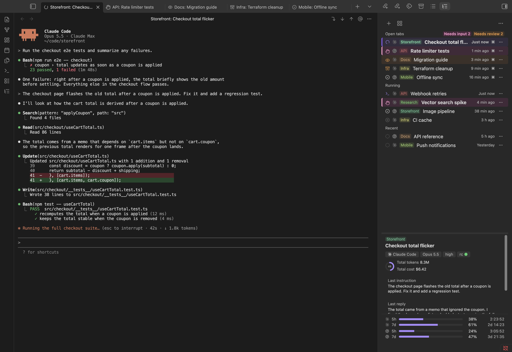
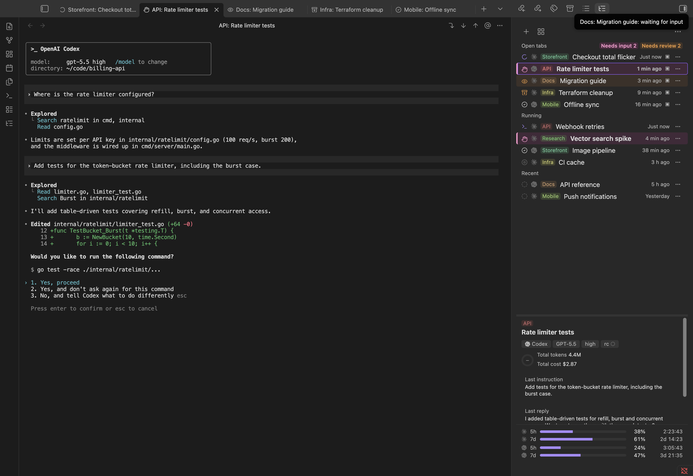

**[English](README.md) | 日本語**

# Agent Sessions

[Obsidian](https://obsidian.md) の中で [Claude Code](https://claude.com/claude-code)・[Codex](https://github.com/openai/codex)・[OpenCode](https://opencode.ai) のセッションをターミナルタブとして開き、管理するプラグイン。セッション一覧・利用状況ダッシュボード・タブを閉じても Obsidian を閉じてもセッションを生かし続けるデーモンを持つ。



## 主な特徴

- **複数エージェント対応** — Claude Code・Codex・OpenCode のセッションを同じ一覧に混在させ、並べ替え・絞り込みも一緒に行う。初回起動時に自動検出し、好きなものを有効化でき、エージェントごとにパスと環境変数を設定できる。複数を有効にしているときは「新規セッション」でどれを起動するか選べる。OpenCode は `ollama launch opencode` 経由でも起動でき、ローカルモデルを使える。
- **ターミナルタブ** — 1 セッション＝1 タブ、実体は PTY（xterm.js）。タブを閉じても Obsidian を終了してもセッションは動き続け、開き直すと直前の画面が再生される。
- **サイドパネル** — 右サイドバーに「開いているタブ」「起動中」「最近」の一覧、詳細欄、5 時間／7 日のレート制限（リセットまでのカウントダウン付き）。
- **セッションマネージャー** — カテゴリでまとまったセッションの木、並べ替えられる表（最終更新・モデル・エフォート・5h／7d のコスト・フォルダ）、利用状況の分析パネル：5 時間／7 日枠の統計カード、7 日枠のペース判定（「順調」か「このままでは使い切る」）、カテゴリ別のコスト内訳——有効なエージェントが複数あれば、エージェントごとの節に分かれる。
- **状態が分かるタブと行** — 処理中・シェルコマンド実行中・回答待ち・未読の応答・編集中・compact 済み・未接続・終了・エラーなど、セッションの状態ごとにアイコン・色・動きを出す。ターミナルタブ・サイドパネル・マネージャーで表示を揃える。
- **命名とカテゴリ** — 「カテゴリ: 名前」の形で名付けると、カテゴリごとに固定の色が付き、マネージャーで専用のグループになる。
- **内蔵エディタ** — セッション中に Ctrl+G を押すと、ターミナルの下に分割された編集領域が開き、今のプロンプト（または `/memory`・`/keybindings` 等）を編集できる。`@` によるファイル補完・自動保存・ネイティブのペースト／IME／Undo に対応。編集中もターミナルの出力は見えたまま。
- **移動の補助** — 出力中に現れるファイルパスは vault 内に実在すればクリックできるリンクになり、「現在のノートを `@path` として挿入」、前の指示・次の指示・最後の応答へのジャンプボタンを持つ。
- **セッション解析と利用状況** — セッション単位のトークン・コストをターン表付きで、アカウント全体の 5 時間／7 日の利用量を、どちらも各エージェント自身の transcript から算出する。
- **CLI と TUI** — Obsidian の外や自動化から使える単体の `agent-sessions` コマンド：セッションを選んで attach する TUI と、プラグインを裏で支える `json` サブコマンド。
- **日英 2 言語の UI** — 「自動」（Obsidian の言語設定に合わせる）・日本語・English を選べる。




## 対応環境

| | |
|---|---|
| **OS** | macOS——動作確認済み。Linux（WSLg 上の Linux 版 Obsidian を含む）——対応（ターミナルのキー割当と Python 側の両方にプラットフォーム分岐を持ち、CI と手動での Linux コンテナ検証を通している）が、実機の Obsidian での通しの動作確認はまだ済んでいない。Windows（ネイティブ）——非対応：デーモンは `pty`・`fcntl`・`termios`（Windows に相当するもののない Unix 専用の標準ライブラリ）に依存しており、Windows ネイティブ版の Obsidian には保持すべき PTY 自体が存在しない。WSLg 等で Linux 版の Obsidian を動かせばこの制約を回避できる。Windows ネイティブ版ではプラグインは読み込まれるが、理由を示すだけで何も起動しない。 |
| **Obsidian** | デスクトップ版のみ（`isDesktopOnly`。プロセスの起動と Unix ソケットを使うため——どちらもモバイル版・Web 版では使えない）、バージョン 1.8.7 以降（`minAppVersion`）。 |
| **Python** | 3.9 以降、標準ライブラリのみ。macOS：Command Line Tools の `python3`（`xcode-select --install`）・python.org・Homebrew のいずれか。Linux：ディストリビューションの `python3`。 |
| **Claude Code／Codex／OpenCode（いずれか 1 つ以上）** | いずれか 1 つ以上をインストール済みで、`PATH` にあるか、プラグインの「エージェント」設定でパスを指定する（初回起動時に自動検出）。Claude Code：本プラグインは Claude Code のフック（`Stop`・`SessionEnd`・`SessionStart`（matcher `compact`）・`UserPromptSubmit`）と `statusLine`、そして送信キーの設定を既定から変えた場合のみ `keybindings.json` に依存する。Codex：hooks／statusLine 相当はまだ使っていない。実機での確認はまだ済んでいない（[`docs/design.md`](docs/design.md) §7.7・§25 参照）。OpenCode：セッションは SQLite のデータベースから読み、busy／idle／waiting は OpenCode を有効にしたときにプログラムが入れる小さな OpenCode プラグインが伝える。`ollama launch opencode` で起動するには [Ollama](https://ollama.com) も必要。 |
| **Node.js／npm** | ソースからプラグインをビルドする場合のみ必要（[開発](#開発)を参照）。CI では Node.js 20 でビルドしている。 |

## 開示事項

- **プラグイン自身はネットワークを使わない。** 通信するのは、同じマシン上の自分のデーモンとだけ（Unix ソケット）。プラグインが起動する Claude Code・Codex・OpenCode は、利用者自身のアカウントでそれぞれのサービスに接続する。
- **ローカルのプログラムを起動する。** `agent-sessions` を利用者の Python で動かす（プラグインに読めるソースとして同梱され、インストールを押したときにだけ書き出す）。インストール済みの Claude Code・Codex・OpenCode の CLI（または `ollama launch opencode`）を起動し、ターミナルと同じ `PATH` で動くよう、ログインシェルの環境変数を読む。コードをダウンロードすることは無い。
- **vault の外のファイルを読み書きする。** エージェントと `agent-sessions` が状態をそこに置くため：
  - セッション一覧と使用量のために、Claude Code の `~/.claude/projects/`・`~/.claude/sessions/`・`~/.claude/settings.json` 、Codex の `~/.codex/`（または `$CODEX_HOME`）、OpenCode のデータベース `~/.local/share/opencode/opencode.db`（`$XDG_DATA_HOME` 配下の場合もある。読み取り専用で開く）を読む。
  - `~/.agents/sessions/`（デーモンのソケット・ログ・状態のスナップショット・キャッシュ）に書く。
  - プログラムのインストールで、ホームフォルダ内のフォルダに書き出す（[インストール](#インストール)を参照）。インストールと `install.sh` は `~/.claude/settings.json` にフックと `statusLine` を足す（先にバックアップを残す）。送信キーの設定を変えると `~/.claude/keybindings.json` に書く。
  - Codex を有効にしている場合、`~/.codex/config.toml` に送信キーのキーマップと既定の `[tui].status_line` を足す（先にバックアップを残す。足した行には印が付き、`agent-sessions setup --remove` はその行だけを取り除く）。
  - OpenCode を有効にしている場合、ステータス用プラグイン `~/.config/opencode/plugins/agent-sessions.js`（`$XDG_CONFIG_HOME` 配下の場合もある）を書き、そのプラグインがセッションごとの状態ファイルを `~/.agents/sessions/opencode/` に書く。プラグインファイルの先頭には印の行があり、印のあるファイルだけを上書きする。「設定 → agent-sessions プログラム → 削除」または `agent-sessions setup --remove` で取り除かれ、設定で OpenCode を無効にしたときにも取り除かれる。OpenCode を有効にしているとき、インストールのダイアログにこのファイルが並び、プログラムの通常の更新は、すでにあるプラグインファイルを更新するだけで新しく作ることはない。
  - 内蔵エディタは、エージェントが `$VISUAL`（OpenCode は `$EDITOR`）に渡す一時ファイルを編集する。
- **一覧に出さないセッション。** OpenCode のサブエージェントのセッションと、`opencode run` で始めたセッションは一覧に出さない。
- **vault のファイル一覧を読む**のは、内蔵エディタで `@` のファイルパスを補完するときだけ。
- **クリップボードを使う**のは、操作したときだけ：セッション ID や解析表のコピーと、ターミナルタブでの Ctrl+Shift+C／Ctrl+Shift+V（Linux のキー割当）。
- **独自のアカウント・支払い・広告・テレメトリは無い。** すべて MIT ライセンスのオープンソース。

## インストール

プラグインは、セッションを保持しエージェントの記録を読む小さな Python プログラム `agent-sessions` を使って動く。プログラムは読めるソースのままプラグインに同梱されており、ワンクリックで入る。Python 3.9 以降はあらかじめ入っている必要がある（[対応環境](#対応環境)を参照）。

1. Obsidian の **設定 → コミュニティプラグイン → 閲覧** で **Agent Sessions** を探し、インストールして有効にする。
2. サイドパネル（リボンの **Agent Sessions** アイコン）を開き、**agent-sessions をインストール** を押す。何かを書き込む前に、置き場所・動かす Python・Claude Code の設定への変更が確認画面に出る。**インストール** を押せば残りは済む。

置き場所は、`$XDG_DATA_HOME/agent-sessions`・`~/.local/share/agent-sessions`・`~/.agents/sessions/app` のうち最初に使えるもの。空白やシェルの特殊文字を含むパス（フックのコマンドと `$VISUAL` に入るため）、vault の中、書き込めない場所は飛ばす。Python は、ログインシェルが `python3` として見つけるもの、無ければ `/opt/homebrew/bin`・`/usr/local/bin`・`/usr/bin` の順に探す（macOS の `/usr/bin` は Command Line Tools が入っている場合だけ使い、仮の入口のインストール画面を出さない）。プラグインを更新するとプログラムも更新される。入れ直し・削除は **設定 → agent-sessions プログラム** から。

### clone から入れる

自分のターミナルで `agent-sessions` コマンド（TUI・スクリプト）を使う場合や、チェックアウトからそのまま動かす場合は、このリポジトリから入れる——`~/bin/agent-sessions` があれば、プラグインは常にそちらを使う：

```sh
git clone https://github.com/kulikala/obsidian-agent-sessions.git
cd obsidian-agent-sessions
./scripts/install.sh
```

プラグイン本体もソースから入れる場合は、ビルドしてから `install.sh` に vault を渡す。この clone の `plugin/` も vault にリンクされる（その後、「コミュニティプラグイン」で **Agent Sessions** を有効にする）：

```sh
(cd plugin && npm install && npm run build)
./scripts/install.sh /path/to/your/vault   # または AGENT_SESSIONS_VAULT=/path/to/your/vault ./scripts/install.sh
```

`install.sh` が行うこと：

- `bin/agent-sessions`・`bin/agent-sessions-code` を `~/bin` に symlink する。
- vault を渡した場合、`plugin/` を `<vault>/.obsidian/plugins/agent-sessions` に symlink する。
- `agent-sessions setup` を実行する。これは **`~/.claude/settings.json` を書き換える**（先に `settings.json.bak-<時刻>` としてバックアップを残す）：`Stop`・`SessionEnd`・`SessionStart`（matcher `compact`）・`UserPromptSubmit` の各フックを `agent-sessions hook` に向けて追加・更新し、`statusLine` を `agent-sessions status` に設定する。自分が付けたと分かるエントリだけを触り、他のフックはそのまま残す。

**送信キー**の設定を既定（Enter）以外に変えると、Claude Code 自身のキー割当と揃えるため、プラグインは `~/.claude/keybindings.json`（`Chat` コンテキスト）にも書き込む——これは Obsidian の外で起動した Claude Code を含め、Claude Code 全体に効く（ただし、選んだキーが確実に働くのはこのプラグイン自身のターミナルタブだけで、他のターミナルアプリがそのキーを素の Enter と区別できるかはターミナル次第）。設定を元に戻すと、この設定のためにプラグインが管理している鍵が消える。

プラグインが一度でも起動していれば、Obsidian の外で `agent-sessions` CLI を使うときも vault のパスを重ねて指定する必要はない——`~/.agents/sessions/vault.json`（プラグインが最新に保つ）から vault の場所を読む。

## 使い方

| 場所 | できること |
|---|---|
| サイドパネル（右サイドバー） | 新規セッション、セッションマネージャーを開く、設定。一覧は「開いているタブ」「起動中（デーモンには居るがタブが無い）」「最近」に分かれ、各行は状態の印・カテゴリのチップ・名前を出す。セッションが1つも無いときは、代わりに「新しいセッション」ボタンを表示する（エージェントが使えないときは設定を開くリンクに）。詳細欄（モデル・エフォート・接続状況、コンテキスト使用率、総トークン・総コスト、直近の指示・応答）。レート制限は、有効な各エージェントごとに5時間／7日枠のバーとリセットまでのカウントダウンを表示。 |
| セッションマネージャー | 新しいタブの既定の画面。セッションの木（カテゴリでグループ化、「その他」区分とアーカイブを含む）と、その下の折畳・リサイズ可能な分析パネル：5 時間／7 日の利用状況カード、7 日枠のペース判定、カテゴリ別のコストの帯——有効なエージェントが複数あれば、エージェントごとの節に分かれる。開いてもセッションは始まらない。 |
| ターミナルタブ | 1 セッション（Claude Code・Codex・OpenCode のいずれか）＝1 タブ。ヘッダの操作：現在のノートを `@path` として挿入、前の指示・次の指示・最後の応答へジャンプ。`Cmd +`／`Cmd −`／`Cmd 0`（macOS）または `Ctrl+Shift+=`／`Ctrl+Shift+-`／`Ctrl+Shift+0`（それ以外）でそのタブのフォントサイズを変える。非 macOS では `Ctrl+Shift+C`／`Ctrl+Shift+V` が選択のコピー・貼り付け、`Ctrl+Shift+W` でタブを閉じ、`Ctrl+Shift+P` でコマンドパレットを開く。素の `Ctrl+<key>`（`Ctrl+C`・`Ctrl+G`・`Ctrl+W`・`Ctrl+P` 等）は常にそのエージェントへ届き Obsidian には渡らない。送信キーの設定と Enter の横取りは全エージェントのタブに効く。Claude Code と Codex は自身のキー割当を設定に合わせて書き換え（開示事項を参照）、OpenCode は書き換えない——選んだ送信キーは Enter を送り、それ以外の Enter の組み合わせは改行を送る。出力中のパスは vault 内に実在すればクリックできる。 |
| Ctrl+G（内蔵エディタ） | Claude Code が本来 `$VISUAL` に渡すファイルを、ターミナルの下の分割された編集領域で編集する。`@` によるファイル補完・自動保存・ネイティブのペースト／IME／Undo に対応。プロンプト編集での「送る」は即座に送信、Esc は送信せず入力欄に戻る。 |
| 行メニュー（⋯／右クリック） | 名前を変更、カテゴリに移動（1行の入力欄——既存カテゴリのドロップダウンと自由入力の両方に対応。セッションに名前も最初のプロンプトも無いうちは使えない）、圧縮（`/compact`）、セッション解析結果を見る、アーカイブ⇄解除、セッションを終了、ID をコピー。 |
| セッション解析結果 | 行メニューから開く。コスト・トークン・ターン数・期間のカード、入力／出力／ツール使用のバー、ターン表。行をクリックして区間を選び、結果を Markdown としてコピーできる。 |

### セッションの状態

ターミナルタブ・サイドパネルの行・マネージャーの行は、セッションの状態について同じアイコン・色・動きを共有する：接続中、処理中（応答を生成中）、シェルコマンド実行中、回答待ち（質問または許可プロンプト）、未読（応答が終わったがまだタブを前面にしていない）、編集中（内蔵エディタが開いている）、待機、未接続（タブはあるがまだ接続していない）、compact 済み（`/compact` の直後で文脈がリセットされている）、終了、エラー。動きのある状態は `prefers-reduced-motion` を尊重する。

これらはさらに、Claude 本体のアプリがセッションを絞り込む際と同じ区分にまとめられる——入力待ち・レビュー待ち・実行中・完了、それぞれ対応するアイコンと色を揃え、加えてアーカイブ済みの区分もある。セッションマネージャーのツールバーには、この同じ6区分（すべて／入力待ち／レビュー待ち／実行中／完了／アーカイブ済み）で絞り込むメニューがある。

状態マークの横の小さなアイコンで、そのセッションがどのエージェント（Claude Code／Codex／OpenCode）かが分かる——各エージェント自身のマーク（単色、他のアイコンと揃えた色）で、色付きのブランドロゴではない。

## 設定

フォント名とサイズ、余白（ゆったり／小さめ／なし）、送信キー、最近の件数、指示待ちの通知、エージェント（Claude Code／Codex／OpenCode——有効化・パス・環境変数。OpenCode はさらに、直接起動か `ollama launch opencode` 経由かと、使う Ollama のモデル（`ollama list` から選ぶか直接入力））、`agent-sessions` のパス、ターミナルのスクロールバック行数、内蔵エディタの高さ、表示言語（自動／日本語／English）、サイドパネルの詳細欄とマネージャーの分析パネルの保存された高さ。

## トラブルシューティング

- **「agent-sessions が見つからない」と出る** — プラグインは入っているが、`agent-sessions` プログラムが入っていない。[インストール](#インストール)の手順 2 を実行する。`~/bin` 以外に置く場合は、プラグインの設定でパスを指定する。
- **Claude Code のフック（他のプラグイン自身のフックスクリプトなど）が `node: not found` のようなエラーで失敗する** — node が mise／nvm／asdf／volta などのバージョンマネージャー経由で入っており、そのシェル統合が対話シェル（`.zshrc`／`.bashrc`）でしか読み込まれない環境である可能性が高い。通常、セッションの起動環境は login-but-non-interactive なシェルから組み立てている。プラグインは対話シェルの `PATH` も探ってこれに合流させている（`docs/design.md` §4.2）ので、次のセッションからは直るはず。直らない場合は、普通のターミナルで `$SHELL -i -c 'echo $PATH'` に node のディレクトリが実際に含まれているか確認してほしい。

## CLI

```sh
agent-sessions                 # TUI：セッションを選んで attach／再開
agent-sessions attach ID       # 端末から attach（Ctrl+\ で detach）
agent-sessions daemon [--detach]
agent-sessions json scan|live|detail ID|usage ID [--from ISO --to ISO]|stats
agent-sessions setup [--dry-run]
agent-sessions setup --opencode   # OpenCode のステータス用プラグインだけを入れる（--remove-opencode でそのファイルだけを取り除く）
```

`agent-sessions json` はプラグイン自身が使う機械可読の窓口（`scan`・`live`・`detail`・`usage`・`stats`）。`hook`・`status` は上記の Claude Code のフックと `statusLine` の受け口。`edit` は内蔵エディタの受け口。

## 仕組み

小さなデーモン（`agent-sessions daemon`。プラグインが必要なときに起動する）が各セッションの PTY を Unix ドメインソケット越しに保持するので、タブが attach していなくてもセッションは動き続ける。プラグインはターミナルの入出力についてデーモンと直接やり取りし、それ以外（transcript の走査、利用状況・コストの計算、セッションの木の構築）は `agent-sessions json …` を呼ぶ——このロジックはすべて Python 側にあり、プラグインと CLI／TUI が同じデータを見る。

セッションの管理情報（折畳・アーカイブ・カテゴリの色）は `<vault>/.agents/sessions/sessions.json` に、デーモンと実行時の状態（ソケット・ログ・status のスナップショット・キャッシュ）は `~/.agents/sessions/` 配下に置く。Claude Code 自身のファイル（`~/.claude/projects/*/*.jsonl`・`~/.claude/sessions/*.json`）は読むだけで、書き換えることはない。

設計の全体は [`docs/design.md`](docs/design.md)、本プラグインが拠って立つ要件は [`docs/requirements.md`](docs/requirements.md) を参照。

## アンインストール

プラグインからプログラムを入れた場合は、先に **設定 → agent-sessions プログラム → 削除** を押す。デーモンを止め（動いているセッションは終了する）、`~/.claude/settings.json` のフックと `statusLine`、`~/.codex/config.toml` の管理行、`~/.config/opencode/plugins/` のステータス用プラグインを取り除き、フォルダを消す。その後、「コミュニティプラグイン」で **Agent Sessions** を無効化・削除する。

clone から入れた場合：

```sh
"<このリポジトリのパス>/scripts/uninstall.sh"            # コミュニティプラグインから入れた場合
"<このリポジトリのパス>/scripts/uninstall.sh" "<vault>"  # ソースから入れた場合
```

`uninstall.sh` は、デーモンを止め（動いているセッションが残っていれば確認を求める——飛ばすには
`--force`）、`~/.claude/settings.json` から自分が足したフックと `statusLine` を取り除き
（`install.sh` と同じやり方で先に backup を残す）、送信キーを Enter 以外に変えていた場合は
`~/.claude/keybindings.json` の `Chat` に足した `enter`／`meta+enter` を取り除き、
`~/bin/agent-sessions`・`~/bin/agent-sessions-code` と、vault を渡した場合は
`<vault>/.obsidian/plugins/agent-sessions` の symlink を外す（symlink でなければ——手で置き換えている等——消さずに案内だけ出す）。他の
ツールのフック・`statusLine`・キーバインドには触れず、何度実行しても安全（冪等）。

`--purge` を付けると `~/.agents/sessions/`（デーモンの実行時状態）と、vault を渡した場合は
`<vault>/.agents/sessions/`（折畳・アーカイブ・カテゴリの色などのセッション管理情報）も消す。

## 開発

```sh
cd plugin && npm install
npm test && npm run typecheck && npm run build   # プラグイン（vitest・tsc・esbuild）
AGENT_SESSIONS_BIN=$PWD/../bin/agent-sessions npm test   # 実デーモンを使うテストも走らせる

cd ..
python3 -W error -m unittest discover -s tests -t .   # Python（標準ライブラリのみ）
```

### スクリーンショット

README の画像は生成物。`npm run build` の後に `node tools/screenshots/shoot.mjs` を実行すると、ビルド済みのプラグインを隔離した別の Obsidian で架空のセッションに対して動かし、`docs/images/` に書き出す。詳細は [`tools/screenshots/README.md`](tools/screenshots/README.md)。

### 言語を追加するには

`plugin/src/i18n/locales/<code>.ts`（`Partial<Record<MessageKey, string>>` と、自称名を持つ
`<CODE>_SELF_NAME` の組——`locales/ja.ts` を参照）と `agentsessions/i18n/locales/<code>.py`
（`MESSAGES` 辞書——`locales/ja.py` を参照）を追加し、それぞれ1行ずつ `i18n/index.ts` の
`LOCALES` と `i18n/__init__.py` の `_TABLES` に登録する。言語は不完全な状態から始めてよく、
未対応のキーはどちらの側でも英語にフォールバックする。詳細は
[`docs/design.md`](docs/design.md#17-i18n) を参照。

### リリース（メンテナ向け）

```sh
cd plugin && npm version minor --no-git-tag-version   # patch / major も可。plugin/package.json・plugin/manifest.json・直下の manifest.json・versions.json を更新する
cd .. && git commit -am "Release X.Y.Z"
git tag -a X.Y.Z -m "Agent Sessions X.Y.Z"   # 「v」を付けない素の版番号。manifest.json の version と完全に一致させる
git push origin main X.Y.Z
```

`npm version` はリポジトリの直下ではない `plugin/` で動くため、ファイルは更新するがコミットとタグは作らない。コミットとタグは上のとおり手で作る。

タグを push すると `.github/workflows/release.yml` が走り、プラグインをビルドして `main.js`・`manifest.json`・`styles.css` を GitHub Release の下書きに添付する。下書きの内容を確かめてから公開する。

## ライセンス

MIT。全文は [`LICENSE`](LICENSE)。`plugin/main.js` には xterm.js とそのアドオン（同じく MIT）が同梱されており、そのライセンス全文と著作権表示は [`THIRD_PARTY_NOTICES.md`](THIRD_PARTY_NOTICES.md) にある。
