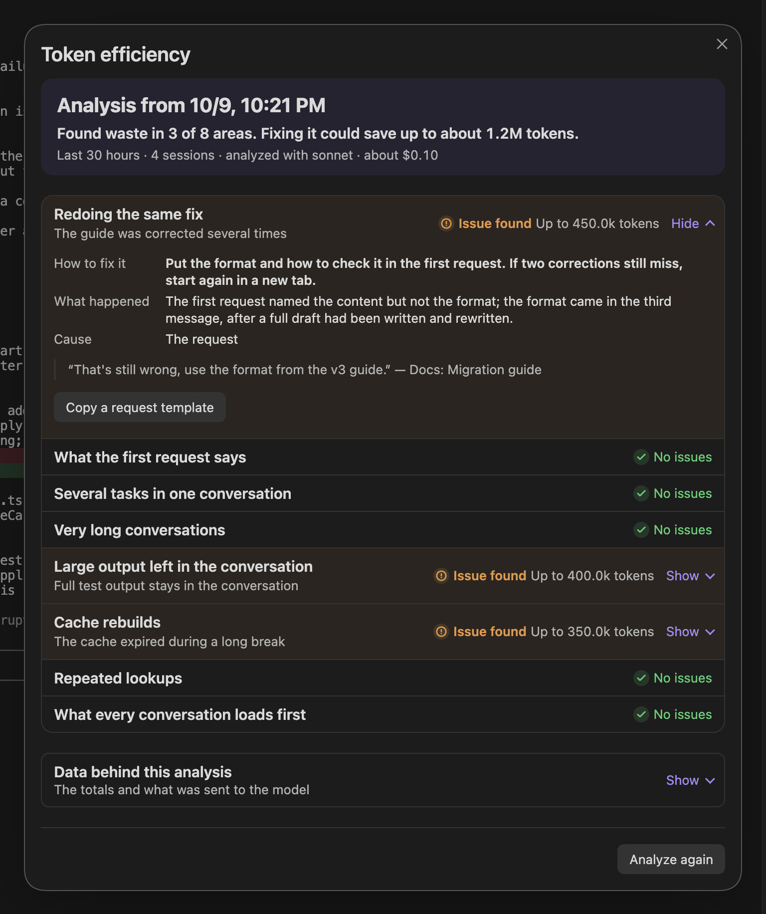

**English | [日本語](README.ja.md)**

# Agent Sessions

An [Obsidian](https://obsidian.md) plugin that runs [Claude Code](https://claude.com/claude-code), [Codex](https://github.com/openai/codex) and [OpenCode](https://opencode.ai) in terminal tabs next to your notes. One list shows every session's state and cost, plus each agent's usage limits.

Desktop only: macOS, Linux, and Windows.

## Features

### Sessions by category, with usage and cost

The **Session manager** groups sessions named `Category: Name` and shows their cost per 5-hour and 7-day window. Below, each agent's usage windows show the time to reset and whether you will reach the limit at your current pace. Costs are estimates, calculated on your machine from the agents' local files. [More](docs/usage.md#session-manager)

### Start a session with any agent

**New session** asks for a name, and which agent when more than one is on. Claude Code, Codex and OpenCode sessions share the same lists. [More](docs/usage.md#start-a-session)

### The agent's own CLI in a tab

Each session is the agent's command-line program in an Obsidian tab, with your settings, login, slash commands, hooks, skills and MCP servers. Vault paths in the output open as links. [More](docs/usage.md#work-in-a-session-tab)

### Switch between sessions in the side panel

Open tabs, running sessions without a tab, and recent ones, each with an icon for its state, plus one for a Claude Code or Codex `/goal` while it is active and once it is met, until your next prompt. A Claude Code session with scheduled work (`/loop`, a cron job or a wakeup) shows a schedule badge, and a scheduled run that finishes while you are elsewhere marks the row until you open its tab. The details below the list name the selected session's state and explain it in a sentence. Click one to bring its tab to the front or open it again; an ended session resumes its conversation. Sessions keep running when you close the tab or quit Obsidian. [More](docs/usage.md#switch-between-sessions)

### Remote Control from claude.ai and the Claude app

The **rc** switch in the side panel starts one Remote Control server for the vault. While it is on, claude.ai and the Claude app can start Claude Code sessions in this vault, and they appear in the side panel like any other. The switch is off by default and only a click turns it on; see [Network](#network). **Copy the connection link** in the ⋯ menu copies the link to connect with. [More](docs/usage.md#remote-control-server)

### A built-in editor for prompts

Press Ctrl+G to write the prompt in a pane under the terminal, with `@` file completion, normal paste, undo and IME, while the output stays visible. For Claude Code, the bar also sets model and effort. [More](docs/usage.md#built-in-editor)

### Rename and sort into categories

Each session has a ⋯ menu, which a right-click also opens. Its **Rename** gives the session a name; a name like `Docs: Release notes` puts it in the Docs category, with its own color and group. **Move to category…** changes only the category. [More](docs/usage.md#name-and-group-sessions)

### Names and categories suggested by an agent

**Organize names and categories** has one of your agents suggest a name and category for recent sessions. Nothing is renamed until you press **Apply selected**. It sends session excerpts to that agent; see [What Organize sends](#what-organize-sends). [More](docs/usage.md#organize-names-and-categories)

### Compact, restart or change model from the session menu

In the same menu, **Compact session** sends `/compact`, and **Restart session** picks up changed settings or skills and keeps the conversation. For Claude Code, **Change model…** switches model and effort. [More](docs/usage.md#compact-restart-and-change-model)

### Where tokens could be saved

**Stretch your usage limit…**, in the ⋯ menu of the side panel and the Session manager, is for when your usage limit runs out too fast. It has the agent read your recent work and look for wasted tokens in nine areas: redoing the same fix, what the first request says, several tasks in one conversation, very long conversations, large output left in the conversation, cache rebuilds, repeated lookups, what every conversation loads first, and any other waste the agent finds. Each issue says what happened, why, what to do next and how many tokens fixing it could save; one a file can fix can be handed to an agent, which starts in plan mode and shows the change before writing it. Statistics stay on this machine; see [What "Stretch your usage limit" sends](#what-stretch-your-usage-limit-sends). [More](docs/usage.md#stretch-your-usage-limit)

### Setup with the welcome guide

On first install, the welcome guide checks Python and your agents, shows what the helper program will write before installing it, and walks you through your first session. [More](docs/usage.md#welcome-guide)

### What a session cost, turn by turn

**Session analytics** shows one session's cost, tokens, turns and duration, the tools it called, and each prompt with its own input, output and cost. Click the first and last row of a stretch of turns to count only those, and copy the result as Markdown. [More](docs/usage.md#session-analytics)

### When each agent was working

The **Activity calendar** shows working time as blocks, by 7-day window, week or day. Click a block to see its prompts and open the session. [More](docs/usage.md#activity-calendar)

Two [agent skills](docs/usage.md#agent-skills) also let you ask an agent about your usage, your other sessions, or how to use the plugin. All features: [`docs/usage.md`](docs/usage.md).

**Not included:** a chat panel, inline editing of notes, and Obsidian mobile. OpenCode has no usage windows, and its sub-agent sessions and `opencode run` sessions are not listed.

## Requirements

- Obsidian 1.8.7 or later, desktop.
- Python 3.9 or later, no extra packages. It runs the helper program that keeps sessions alive.
- Claude Code, Codex or OpenCode, installed.

## Supported environments

| Obsidian runs on | Agent runs on | Supported |
|---|---|---|
| macOS | macOS | Yes |
| Linux | Linux | Yes |
| Windows 10 (1809+) or 11 | Windows | Yes |
| Windows | WSL | No |
| WSL2 through WSLg | the same WSL distribution | Yes |

Obsidian and the agent must run in the same operating system, because the plugin starts and follows the agent's processes and files. If your agents run in WSL, run Obsidian in WSL through WSLg, and keep the vault in the WSL file system rather than under `/mnt/c`.

## Install

1. In Obsidian, open **Settings → Community plugins → Browse**, search for **Agent Sessions**, install and enable it.
2. Follow the welcome guide that opens. It installs the `agent-sessions` helper program and starts your first session. To come back to it later, run **Continue the welcome guide** from the command palette.

Where the program goes, and installing from source: [`docs/installation.md`](docs/installation.md).

## Troubleshooting

- **"agent-sessions was not found"**: click **Install agent-sessions** in the side panel, or set the program's location in the plugin's settings.
- **"Install agent-sessions yourself (see the README)"**: install it from a clone ([`docs/installation.md`](docs/installation.md#from-a-clone)), then set its location in the plugin's settings.
- **An agent shows "Not found."**: set its path in the plugin's settings, or click **Detect again** in the welcome guide.
- **A session ignores changed settings, hooks or skills**: choose **Restart session** in the session's ⋯ menu.
- **Windows: the install dialog says Python or Claude Code is missing**: click **Install Python with WinGet** or **Install Claude Code with WinGet** (per user, no administrator prompt).
- **Windows on ARM: an OpenCode tab stops at `bun:ffi dlopen() is not available in this build (TinyCC is disabled)`**: OpenCode's ARM64 build (the one WinGet installs there) cannot start its terminal UI. Install OpenCode's x64 build instead; Windows runs it under emulation.
- **A hook fails with `node: not found`**, and other cases: [`docs/usage.md`](docs/usage.md#more-troubleshooting).

## Uninstall

1. **Settings → agent-sessions program → Remove.** This ends running sessions, removes the program, its entries in the agents' settings, and the skills in the vault, and restores your previous OpenCode `tui.json` values.
2. Disable and remove **Agent Sessions** under Community plugins.
3. If you want nothing left, delete `~/.agents/sessions/`, `<vault>/.agents/sessions/`, and the backups `~/.claude/settings.json.bak-*` and `~/.codex/config.toml.bak-*`.

Source installs: [`docs/installation.md`](docs/installation.md#uninstall).

## Disclosures

No telemetry and no account. The agents have the same permissions as in your terminal and connect to their own services under your accounts.

### Network

- Apart from the Remote Control server described next, the plugin and its program make no network connections for their own work. The plugin talks to the program's background process on this machine: a Unix socket (mode 0600), or on Windows `127.0.0.1` on a random port with a secret token.
- Remote Control, when you switch it on with the **rc** toggle in the side panel, runs `claude remote-control --spawn=same-dir --permission-mode auto` in the vault folder. That Claude Code process stays connected to Anthropic's servers and starts a session in this vault for each connection made from claude.ai or the Claude app. Those sessions run in auto permission mode when Claude Code accepts it, and in its default mode otherwise. It is off until you click the toggle, and it is never started by loading Obsidian or the plugin.
- While the welcome guide is open, it loads its pictures from `raw.githubusercontent.com`. No data of yours is sent; GitHub sees your IP address and which picture is requested. Turn this off with **Load the guide's pictures from GitHub** in the settings.

### Programs it starts

- `agent-sessions`, with the Python found on your machine. It is written out from the plugin when you click Install; nothing is downloaded.
- `claude remote-control`, only after you click the **rc** toggle.
- The Claude Code, Codex and OpenCode CLIs you installed, or `ollama launch opencode` if you choose it. The settings run `ollama list` to offer your Ollama models.
- Your shell, as a login shell and as an interactive shell (which reads `.zshrc` or `.bashrc`), to get the same `PATH` as a terminal.
- On Windows: `reg.exe` (to read `PATH`), `py.exe` (to find Python), and `winget.exe` only when you click an install button.

### Files it reads outside the vault

To list sessions and calculate usage:

- `~/.claude/projects/`, `~/.claude/sessions/`, `~/.claude/settings.json`
- `~/.codex/` (or `$CODEX_HOME`)
- `~/.local/share/opencode/opencode.db`, opened read-only

A database that cannot be opened read-only is copied to a temporary folder, read, and deleted.

For Stretch your usage limit, it reads the same Claude Code transcripts, Codex rollouts and OpenCode database. Claude Code records the sizes of `CLAUDE.md`, `.claude/rules/` and auto memory `MEMORY.md` and the number of skills at each session's start, and Codex the `AGENTS.md` it loaded; for OpenCode it reads the size of `AGENTS.md` (or `CLAUDE.md`) in the session's folder and the folders above it up to the Git root, and of `~/.config/opencode/AGENTS.md`. It also reads the top-level `model` and `model_provider` of `$CODEX_HOME/config.toml` and the model list in `$CODEX_HOME/models_cache.json`, and the providers' `baseURL` in `~/.config/opencode/opencode.json` (to tell local models). To find the instruction file that owns a file sessions keep reading, it checks whether a `.git`, a `CLAUDE.md` or (Codex and OpenCode) an `AGENTS.md` exists in the folders above that file.

### Files it writes

| Path | Contents | When |
|---|---|---|
| `~/.agents/sessions/` | socket, logs, status files, caches | always |
| `~/.local/share/agent-sessions` (Windows: `%LOCALAPPDATA%\agent-sessions`) | the program | on Install |
| `~/.claude/settings.json` | four hooks, `statusLine` | on Install |
| `~/.claude/keybindings.json` | submit key, editor key | if changed from the default |
| `~/.codex/config.toml` | submit and editor keys if changed, status line if unset | Codex enabled |
| `~/.config/opencode/plugins/agent-sessions.js` | status plugin | OpenCode enabled |
| `~/.config/opencode/agent-sessions-tui.jsx` | status line | OpenCode enabled |
| `~/.config/opencode/tui.json` | editor key, submit keys, status line entry | OpenCode enabled |
| a temporary file | the prompt being edited | built-in editor open |
| `~/.agents/sessions/efficiency/cache/` | statistics for Stretch your usage limit (numbers and relative paths, no conversation text) | Stretch your usage limit opened |
| `~/.agents/sessions/efficiency/last-<tab>.json`, `prev-<tab>.json` | the last two analyses of each tab (`claude`, `codex-openai`, `opencode-ollama`, …), with masked quotes | after Analyze |
| `~/.agents/sessions/efficiency-run/current/` | the analysis's empty working folder | during Analyze |
| `<vault>/.agents/sessions/sessions.json` | sessions started here (folder, agent), archive, category colors, folded groups | always |
| `<vault>/.claude/skills/` | the `agent-sessions` and `agent-sessions-help` skills | Claude Code enabled |
| `<vault>/.agents/skills/` | the same skills | Codex enabled |
| `<vault>/.opencode/skills/` | the same skills | OpenCode alone |

- `~/.claude/settings.json` and `~/.codex/config.toml` are backed up before they are changed. The previous `tui.json` values are kept in `~/.agents/sessions/opencode-tui-backup.json`.
- Its entries are marked (Codex, OpenCode, skill files) or recognized by their command (Claude Code); nothing else is changed.
- `sessions.json` travels with the vault if you sync it.
- Other folders the program may be installed in: [`docs/installation.md`](docs/installation.md#where-the-program-goes).

### What Organize sends

Nothing is sent until you press **Suggest** in **Organize names and categories**. Then the plugin runs one of your agents once, and the dialog names which:

- Claude Code: `claude -p` with Sonnet (or Haiku, in the settings), without tools, nothing saved. Else
- Codex: `codex exec` in a read-only sandbox, without tools (shell, web search, MCP servers). Else
- OpenCode: `opencode run` without tools, its stored session deleted afterwards.

For up to 30 sessions, or the one you chose, it sends the current name, the folder, the first prompt, your last three prompts and a short excerpt of the last reply (the folder, prompts and reply masked as for the analysis, below); your existing category names with their session counts and up to three example session names each; and, if you ask again, the previous suggestion and your comments. This goes to that agent's service under your account and counts toward its usage limits.

### What "Stretch your usage limit" sends

Opening **Stretch your usage limit…** computes statistics on this machine and sends nothing. Only when you press **Analyze** in a tab does the plugin run that conversation's own agent: once, judging all nine areas, or, when the range is too large for one request, once per period, one after another, at most ten times. Codex and OpenCode are analysed for the provider their conversations used most; conversations held with another provider are left out.

- Claude Code: `claude -p` with Sonnet (or Opus, in the settings), without tools, nothing saved.
- Codex: `codex exec` with a read-only sandbox, without tools and no rollout saved, on a model Codex lists for your account (`$CODEX_HOME/models_cache.json`): its newest generation, and in it Sol, else Terra, else Luna; when Codex refuses one, the next tier, then the next older generation, then the model in `config.toml`. A local provider (Ollama, LM Studio) uses its most used model in the range.
- OpenCode: `opencode run` without tools, with the provider and its most used model in the range; the run's session is deleted afterwards. A provider on this machine (Ollama, LM Studio, or a `baseURL` on this machine) is analysed by its local model, so nothing leaves the machine.

A conversation is never sent to another agent or provider, and a tab's statistics name only that provider's sessions. **Details**, below **Analyze**, shows where it goes, about how much and in how many requests before you press it, and **Show what is sent** in it shows the exact text of every request.

What is sent is a digest of every task in the range: the masked session names and folders, the range's totals, the sizes of the instruction files and the number of skills, what the statistics noticed, and for each turn your prompt (up to 600 characters), the start of the agent's reply (200 characters) and its numbers (tokens, tool calls by kind, the paths read, searched or edited, interrupts, pauses, time taken, context size, cache written again, models). Tool output and file contents are not sent. Paths, URLs (with any user name and password in them), e-mail addresses and anything that looks like a key or token are masked, and your home folder and user name are replaced wherever they appear (in a path of any system, or as a folder name of their own). At most 60,000 characters per request; a larger digest is split into requests by period, at most ten, and beyond that the prompts are shortened and then the oldest tasks left out. How many tokens a fix could save is worked out by the plugin from the records, not by the agent. The run starts in an empty folder, `~/.agents/sessions/efficiency-run/current/`, made fresh for each run and removed when it ends; Claude Code keeps one empty project folder for it under `~/.claude/projects/`. The statistics cache holds no conversation text; the last two results, with their masked quotes, stay in `~/.agents/sessions/efficiency/` until you delete them. This goes to that agent's service under your account and counts toward its usage limits.

**Ask the agent to fix it** only starts a new session in the vault, with a request you can read and edit first: Claude Code in plan mode, Codex with a read-only sandbox that asks before writing, OpenCode with its `plan` agent. The plugin writes no file itself.

### Other access

- The vault's file list: only to complete `@` paths in the built-in editor.
- The clipboard: only when you copy a session ID, an analysis table or the Remote Control connection link, or press Ctrl+Shift+C / Ctrl+Shift+V in a terminal tab (not on macOS).

## Development

Build, test, release and design: [`docs/development.md`](docs/development.md).

## License

MIT, see [`LICENSE`](LICENSE). `plugin/main.js` bundles xterm.js and its addons (also MIT); their notices are in [`THIRD_PARTY_NOTICES.md`](THIRD_PARTY_NOTICES.md).
