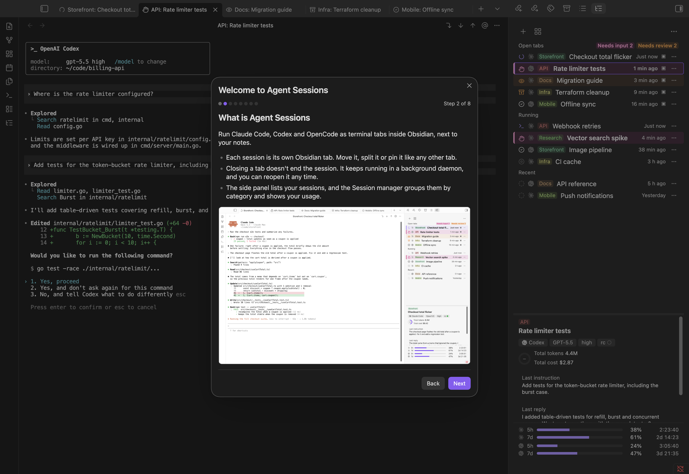

**English | [日本語](README.ja.md)**

# Agent Sessions

**Run [Claude Code](https://claude.com/claude-code), [Codex](https://github.com/openai/codex) and [OpenCode](https://opencode.ai) as real terminal tabs in [Obsidian](https://obsidian.md), and keep track of every session and every dollar.**

*Real terminal. Many sessions. Full picture.*

Agent Sessions runs your agent CLIs exactly as they run in a terminal, keeps every session alive in the background, and shows what each one costs you, in a session manager and usage analytics view that sit next to the tabs.


## Why Agent Sessions

### Many agents in parallel, one overview

For people who run several agent sessions at once. Sessions keep running when you close a tab or quit Obsidian, and reopening one replays its last screen. A side panel and the **Session Manager** show every session's state (working, waiting for you, unread, done), grouped by category and name. Sessions are named `Category: Name`, and **Organize names and categories** proposes names and categories for you with an agent you already have. Claude Code, Codex, and OpenCode sessions sit in the same list.

### See what they cost

For people who watch their limits. See your 5-hour and 7-day usage windows with a countdown to reset, a weekly-pace projection, cost per session and per category, a turn-by-turn breakdown of any session, and an activity calendar of when sessions were working. Everything is computed on your machine from each agent's own transcripts.


### The real CLI in a real terminal

For people who already live in the agent CLIs. Claude Code, Codex, and OpenCode run in real PTY-backed terminal tabs (a real terminal, or TTY), so slash commands, plan mode, hooks, skills, and MCP are the agent's own. There is no chat screen to re-implement, so a feature the agent ships works in Agent Sessions the day it ships.

### Made for heavy use, easy to start

A welcome guide walks you through the first session with pictures and checks each step as you do it. A built-in editor (Ctrl+G) opens under the terminal for long prompts, with `@` file completion. You can switch the model and effort of a running Claude Code session from a menu, restart a session to pick up new settings, and organize a long list of sessions in one dialog. Tab icons, colors, and notifications show which session needs you.


## Is it for you?

**A good fit** if you:

- already use Claude Code, Codex, or OpenCode in a terminal and want them next to your notes;
- run several sessions at once and want to find, name, and group them;
- want to see usage and cost per session without leaving Obsidian;
- want sessions that survive closing a tab or quitting Obsidian.

**Maybe not** if you:

- want an AI chat panel that edits the open note inline: a chat plugin fits that better, and Agent Sessions is for running the agent CLIs themselves;
- use Obsidian on mobile (desktop only);
- run Windows Obsidian with an agent inside WSL (see [Supported environments](#supported-environments)).

## Privacy and safety

- The plugin makes no network connections of its own. It talks to its own background process over a local socket on your machine. The one exception is the welcome guide's pictures, loaded from GitHub while the guide is open (switch it off in settings). The agents you run connect to their own services under your own accounts.
- No telemetry, no accounts, no ads, no payments. MIT licensed.
- Agent settings are edited only after a backup, and only the lines the plugin adds; `agent-sessions setup --remove` takes exactly those out, and **Settings → agent-sessions program → Remove** does the same.
- The installer shows where it will write, which Python will run it, and the change to Claude Code's settings before anything is written.
- The program is Python standard library only, shipped as readable source inside the plugin; it never downloads code.
- The agents have the same permissions as in your terminal, because they run in a terminal.
- The one feature that sends text to an agent is **Organize names and categories**, and only when you press its button.

Every file it reads or writes and every program it starts is listed in [Disclosures](#disclosures).

## Requirements at a glance

- **Obsidian** 1.8.7 or later, desktop only.
- **macOS, Linux, or Windows** (on Windows, Claude Code only; WSL setups are covered in [Supported environments](#supported-environments)).
- **Python 3.9+**, standard library only.
- **At least one agent CLI**: Claude Code, Codex, or OpenCode.

## Install

1. In Obsidian, open **Settings → Community plugins → Browse**, search for **Agent Sessions**, then install and enable it.
2. Open the side panel (the **Agent Sessions** ribbon icon). The welcome guide opens on first install and walks you through the rest: it checks Python and your agents, and installs the `agent-sessions` program with one click after showing exactly what it will write. Close the guide any time and resume it from the command palette.

Installing from source, and where the program goes, is in [`docs/installation.md`](docs/installation.md).

## Supported environments

| Setup | Supported | Verification |
|---|---|---|
| macOS | Yes | Smoke test (all 15 steps) passed on macOS 26.6, Python 3.14 |
| Linux (Ubuntu Desktop) | Yes | Smoke test passed on Ubuntu 24.04 (kernel 6.8), Python 3.12 |
| Windows ①: Windows Obsidian + Windows Claude Code | Yes, Claude Code only | Smoke test passed on Windows 11 build 26300, Python 3.13 |
| Windows ②: Windows Obsidian + WSL1 Claude Code | No | — |
| Windows ③: Windows Obsidian + WSL2 Claude Code | No | — |
| Windows ④: WSLg Linux Obsidian + WSL2 Claude Code | Yes | Supported; not yet verified — steps in [`docs/testing.md`](docs/testing.md#4-platform--checks) |

The smoke test ran on 2026-10-04 on arm64 virtual machines with Obsidian 1.13.7 and a fake agent ([`docs/testing.md`](docs/testing.md)). Windows 10 1809 and later has the ConPTY the daemon needs, but is untested. On Windows ① Codex and OpenCode show "Not available on Windows yet" in the settings and stay off.

The plugin, the program and the agent have to run in the same operating system ([`docs/principles.md`](docs/principles.md#4-supported-platforms-are-the-ones-where-agent-and-plugin-share-an-os)):

- **②** WSL1 shares `localhost` with Windows, but the agent runs inside WSL, so its hooks, status line, transcripts and processes live on the Linux side, and the plugin cannot start, observe or reattach the session.
- **③** The same applies. In addition, under WSL2's default NAT networking WSL cannot reach Windows' `127.0.0.1`, so the built-in editor round trip fails (mirrored networking is untested).
- **For WSL users**, run Obsidian itself in WSL through WSLg (④): it is Linux on both sides.

### Requirements

| | |
|---|---|
| **Obsidian** | Desktop only (`isDesktopOnly`, since the plugin spawns processes and opens local sockets — neither is available to a mobile or web build), version 1.8.7 or later (`minAppVersion`). |
| **Python** | 3.9+, standard library only. macOS: the Command Line Tools' `python3` (`xcode-select --install`), python.org, or Homebrew; Linux: your distribution's `python3`. Windows: the `py` launcher, a python.org install, or `python.exe` on `PATH` (the Microsoft Store's empty `python.exe` alias is never used); the install dialog can install Python for you with WinGet. |
| **Claude Code, Codex, and/or OpenCode** | At least one of the three, either on your `PATH` or pointed to from the plugin's Agents settings (auto-detected on first run). Claude Code: the plugin relies on its hooks (`Stop`, `SessionEnd`, `SessionStart` with matcher `compact`, `UserPromptSubmit`), its `statusLine`, and — only if you change the submit-key setting away from the default — its `keybindings.json`. Codex: no hooks/statusLine equivalent is used yet; hands-on verification is still pending (see [`docs/design.md`](docs/design.md) §7.7, §25). OpenCode: sessions are read from its SQLite database, and busy/idle/waiting comes from a small OpenCode plugin the program installs when OpenCode is enabled. To start a session through `ollama launch opencode`, [Ollama](https://ollama.com) has to be installed as well. On Windows only Claude Code is available; its hooks and `statusLine` are run by Claude Code through Git Bash when that is installed, otherwise through PowerShell (Git for Windows is optional), and the install dialog can install Claude Code with WinGet. |
| **Node.js / npm** | Only if you are building the plugin from source (see [Development](#development)); CI builds with Node.js 20. |

## Features in detail

Each feature is described in full in [`docs/usage.md`](docs/usage.md).

- **Sessions and tabs**: one session per Obsidian tab, backed by a real PTY (a ConPTY on Windows; xterm.js). Claude Code, Codex, and OpenCode sessions mix in one list; agents are auto-detected, and OpenCode can also start through `ollama launch opencode` for a local model. Icons, colors, and motion show each session's state, and a notice reports when a session in another tab finishes or needs an answer. File paths in the output become clickable links into the vault.
- **Side panel and Session Manager**: the right sidebar lists open tabs, running sessions, and recent sessions, with a details pane and a 5-hour/7-day rate-limit view with a countdown. The Session Manager groups sessions by category in a sortable table, with a status filter and a usage-analytics panel below it.
- **Naming, categories, and Organize**: name a session `Category: Name`; categories get a stable color and their own group. **Organize names and categories** proposes short names and categories for recent sessions from their conversation, preferring the categories you already use, with the agent you already have (Claude Code, else Codex, else OpenCode). A session's row menu has **Suggest name and category…** for just that one. You review the proposals, and nothing changes until you press Apply. It sends session excerpts to that agent, see [Disclosures](#disclosures).
- **Restart, model, and effort**: **Restart session** ends the agent and resumes the same conversation in the same tab, to pick up changed settings, hooks, skills, or environment. **Change model…** switches the model and effort of a running Claude Code session without typing `/model` or `/effort`.
- **Built-in editor**: press Ctrl+G to edit the current prompt in a split pane under the terminal, with `@` file completion, autosave, and native paste, IME, and undo; the terminal output stays visible. In a Claude Code prompt its bar switches model and effort.
- **Activity calendar**: a session, a week, or a day at a glance (switch with the toggle; the session period is the 7 days aligned to your usage limit's reset), one lane per agent in each day, with a colored block for each stretch a session was working, read from the transcripts: from your prompt until the agent finished, with turns less than 30 minutes apart joined. Hover a block for its time range and name; click it to open a details panel with the block's turns and prompts and the session's details; toggle each agent on or off.
- **Usage and limits**: account-wide 5-hour and 7-day windows per agent with a countdown and a weekly-pace projection, cost per session and per category, and a turn-by-turn **session analysis** you can copy as Markdown. All of it is computed from each agent's own transcripts.
- **Agent skills**: two skills are installed into the vault with the program. `agent-sessions` lets an agent in the vault read usage, list other sessions, and, only when you ask, start a new one. `agent-sessions-help` answers questions about the plugin in the language you ask in.
- **Remote Control**: renaming a Claude Code session started with Remote Control also renames its Remote Control session (claude.ai and the Claude app).
- **Welcome guide**: opens on first install, and after an update only when the new version has something to show. It sets up the program and the agents, then has you start a real session, switch tabs, rename it, and use the built-in editor, checking each step as you go.
- **CLI and TUI**: a standalone `agent-sessions` command for scripting and for working outside Obsidian.




Session states, settings, the CLI, and the less common troubleshooting cases are in [`docs/usage.md`](docs/usage.md).

## Troubleshooting

- **"agent-sessions was not found"**: the plugin is installed but the `agent-sessions` program isn't. Click **Install agent-sessions** in the side panel ([Install](#install)). If you keep it somewhere other than `~/bin`, set its path under the plugin's settings.
- **Claude Code in WSL, Obsidian on Windows**: not supported (setups ② and ③ in [Supported environments](#supported-environments)). Run Obsidian in WSL through WSLg (④) instead.
- Hooks that fail with `node: not found`, installing Python or Claude Code on Windows, and other cases: [`docs/usage.md`](docs/usage.md#more-troubleshooting).

## Disclosures

- **No network use by the plugin or the program, except the welcome guide's pictures.** The plugin talks to its own daemon over a local socket on this machine (a Unix socket, mode 0600; on Windows loopback TCP on `127.0.0.1` with a random port, and the first thing a client sends is a secret token, so any other connection is closed). The one exception: while the welcome guide is open, the plugin loads its pictures from GitHub (`raw.githubusercontent.com`), pinned to the plugin's version. Only images are fetched and none of your data is sent; GitHub sees your IP address and which picture is requested (no referrer is sent). Turn it off with **Settings → Load the guide's pictures from GitHub** (the guide then shows text descriptions). Claude Code, Codex, and OpenCode, which the plugin launches, connect to their own services under your own accounts.
- **On Windows, runs a few more programs.** Besides Python and the agent, the plugin runs `reg.exe` (to read `PATH` from the registry, so a program installed while Obsidian is running is found without a restart) and `py.exe` (to find Python), always without a console window, and `winget.exe` only when you click an install button for Python or Claude Code in the install dialog. It listens on `127.0.0.1` only.
- **Runs local programs.** The plugin runs the `agent-sessions` program with your Python (it ships inside the plugin as readable source and is written out only when you click Install), starts the Claude Code / Codex / OpenCode CLIs (or `ollama launch opencode`) you have installed, and reads your login shell's environment so they find the same `PATH` as in a terminal. It never downloads code.
- **Reads and writes files outside the vault**, because that is where the agents and the program keep their state:
  - reads Claude Code's `~/.claude/projects/`, `~/.claude/sessions/`, and `~/.claude/settings.json`, Codex's `~/.codex/` (or `$CODEX_HOME`), and OpenCode's database `~/.local/share/opencode/opencode.db` (or under `$XDG_DATA_HOME`; opened read-only), to list sessions and compute usage;
  - writes `~/.agents/sessions/` (the daemon's socket — on Windows, an endpoint file naming its loopback port and token — logs, status snapshots, caches);
  - installing the program writes it to a folder in your home directory (see [Installation in detail](docs/installation.md)); the install and `install.sh` add hooks and a `statusLine` to `~/.claude/settings.json` (backed up first); changing the submit-key or editor-key setting writes `~/.claude/keybindings.json`;
  - with Codex enabled, adds its submit-key keymap, its editor-key line (`open_external_editor`, only for an editor key other than Ctrl+G) and a default `[tui].status_line` to `~/.codex/config.toml` (backed up first; each line it adds is marked, and `agent-sessions setup --remove` takes exactly those out);
  - with OpenCode enabled, writes a status plugin, `~/.config/opencode/plugins/agent-sessions.js` (or under `$XDG_CONFIG_HOME`), and the plugin writes one status file per session under `~/.agents/sessions/opencode/`. The plugin file starts with a marker line; only a file carrying it is ever overwritten, and Remove (Settings → agent-sessions program) or `agent-sessions setup --remove` deletes it, as does turning OpenCode off in the plugin's settings; the installer's dialog lists this file when OpenCode is enabled, and a routine update of the program only refreshes a plugin file that is already there. Next to it, an OpenCode status line, `~/.config/opencode/agent-sessions-tui.jsx` (same marker, same install, update and removal): a small JSX file that `opencode` compiles itself when it loads it, which draws one row at the bottom of OpenCode's session screen from OpenCode's own on-screen state (busy, idle, or waiting for a permission) and, in a session the plugin started, the submit-key symbol from `~/.agents/sessions/ui.json`; it reads and writes nothing else;
  - with OpenCode enabled, sets `keybinds.editor_open` (the editor key; OpenCode's own is Ctrl+X, E) in OpenCode's `~/.config/opencode/tui.json` (or under `$XDG_CONFIG_HOME`), and, with a submit key other than Enter, `keybinds.input_submit` and `keybinds.input_newline` so that Return inserts a newline; and adds the status line, `"./agent-sessions-tui.jsx"`, to its `plugin` list (OpenCode loads such plugins from that list only); no other key is touched, and a file that isn't plain JSON is left alone. Your previous values are kept in `~/.agents/sessions/opencode-tui-backup.json` and put back when you turn OpenCode off or Remove, and the submit keys when you return to Enter (`agent-sessions setup --remove` does the same);
  - whenever the program is installed or updated, writes the `agent-sessions` and `agent-sessions-help` skills (each a folder with `SKILL.md`, the second with a `reference.md` next to it) into the vault's own skill folders, never into your home directory (nothing is written to the vault while no program is installed): `<vault>/.claude/skills/` for Claude Code, `<vault>/.agents/skills/` for Codex, and `<vault>/.opencode/skills/` only when OpenCode is the only agent enabled (OpenCode also reads the first two). Each file carries an `agent-sessions:managed` marker; a file without it is never overwritten or removed. Installing also removes the three skills earlier versions wrote (`agent-sessions-new`, `-stats`, `-info`, only when marked); its text names only the enabled agents, and every copy is rewritten after a plugin update or when the launcher or the enabled agents change, disabling an agent or Remove takes it away again, and the installer's dialog lists the folders. Agents started in other folders do not see it;
  - the built-in editor edits the temporary file the agent hands to `$VISUAL`.
- **Organize names and categories sends session excerpts to an agent CLI.** When you press **Suggest** (or **Suggest again**) in that dialog, the plugin runs one of your installed agents once, headless, from `~/.agents/sessions/organize/`: Claude Code when it is enabled (`claude -p --model sonnet`, or Haiku if you choose it in the settings; no tools, MCP servers, hooks or skills, no transcript saved); otherwise Codex (`codex exec` in a read-only sandbox, no session file written) or OpenCode (`opencode run`; its stored session is deleted right after). The dialog names the agent before you press anything. The prompt holds, for up to 30 sessions (or the one session you chose in its row menu), the folder (its path inside the vault, otherwise its name), the first prompt, the last three prompts you typed and a short excerpt of the last reply, plus your existing category names with up to three example session names each (and, when you ask again, the previous suggestion and your comments). If a proposal breaks the naming rules, a second request for just those sessions is sent. That goes to that agent under your own account and counts against its usage limits. Nothing is sent unless you press the button, and no name is changed unless you press Apply.
- **Sessions not listed.** OpenCode sub-agent sessions and sessions started by `opencode run` are not listed.
- **Lists the vault's files** only to complete `@` file paths in the built-in editor.
- **Uses the clipboard** only when you ask: copying a session ID or an analysis table, and Ctrl+Shift+C / Ctrl+Shift+V in a terminal tab (Linux keybindings).
- **No accounts, payments, ads, or telemetry** of its own. Everything is open source under the MIT license.


## Uninstall

Remove the program first under **Settings → agent-sessions program → Remove**: it stops the daemon (ending running sessions), takes its hooks, status line, keybinds, and lines out of the agents' settings, removes the agent skills from the vault, and deletes its folder. Then disable and remove **Agent Sessions** in Community plugins. Uninstalling a clone install is covered in [`docs/installation.md`](docs/installation.md#uninstall).

## How it works

A small daemon, started on demand by the plugin, holds each session's PTY over a local socket, so a session keeps running when no tab is attached. The plugin talks to the daemon for terminal I/O and shells out to `agent-sessions json …` for everything else (scanning transcripts, usage and cost, the session tree), so the plugin and the CLI see the same data. Claude Code's own files are only ever read. See [`docs/principles.md`](docs/principles.md), [`docs/design.md`](docs/design.md), and [`docs/architecture.md`](docs/architecture.md).

## Development

```sh
cd plugin && npm install
npm test && npm run typecheck && npm run build   # plugin (vitest, tsc, esbuild)
cd .. && python3 -W error -m unittest discover -s tests -t .   # Python (standard library only)
```

Build and test details, the screenshot procedure, how to add a language, and the release steps are in [`docs/development.md`](docs/development.md); testing is in [`docs/testing.md`](docs/testing.md).

## License

MIT, see [`LICENSE`](LICENSE). `plugin/main.js` bundles xterm.js and its addons (also MIT); their license text and copyright notices are in [`THIRD_PARTY_NOTICES.md`](THIRD_PARTY_NOTICES.md).
