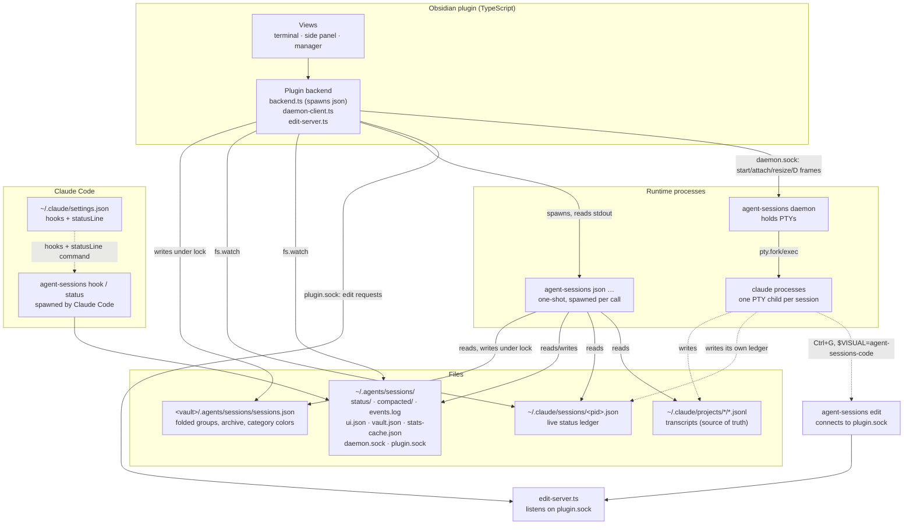
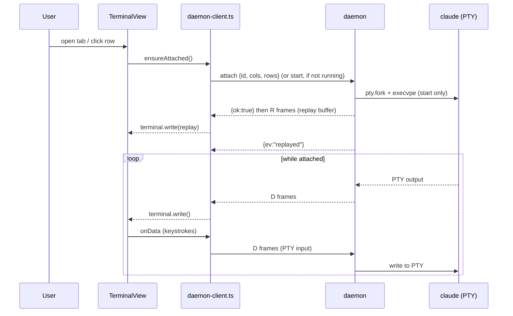
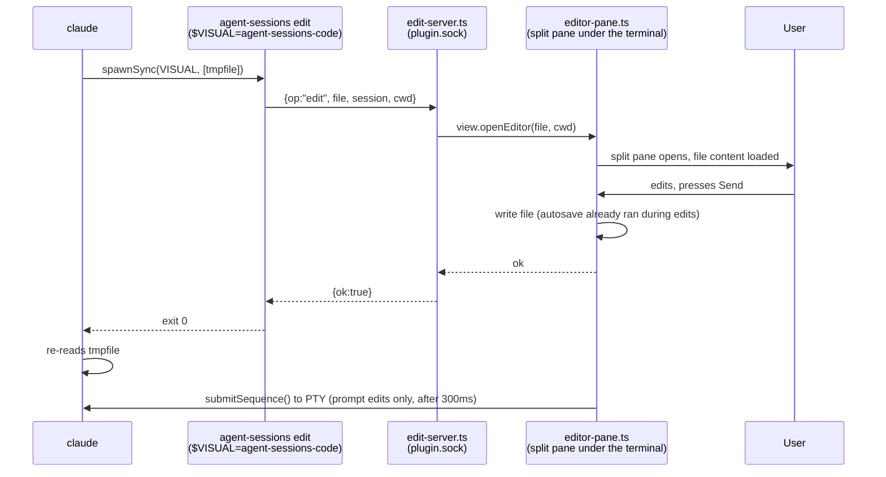

# Architecture

Agent Sessions runs Claude Code sessions as Obsidian terminal tabs by splitting the work across four independent processes that communicate only through files and Unix sockets: an Obsidian plugin, a Python daemon, a Python CLI, and Claude Code's own hooks/`statusLine`. Wire formats, timing, and edge cases are in [`design.md`](design.md).

## 1. The four parts, and why they're separate

Agent Sessions is four pieces that only talk to each other over files and sockets, never by importing each other's code:

- **The daemon** (`agent-sessions daemon`) holds every session's PTY open. It's started on demand by the plugin and keeps running independently of any tab or Obsidian instance being attached to it — closing a tab, or restarting Obsidian, doesn't touch the underlying `claude` process.
- **The CLI / `json` output** (the `agent-sessions` binary) is where scanning transcripts, detecting status, and aggregating usage/cost actually happen. It's pure standard-library Python with no daemon involvement — the plugin spawns it as a short-lived process and reads its JSON on stdout.
- **Claude Code hooks and `statusLine`** (`agent-sessions hook` / `agent-sessions status`) are the same Python codebase's entry points, called by Claude Code itself (via `~/.claude/settings.json`) as each session runs. They write state to small files rather than talking to the plugin directly.
- **The plugin** (Obsidian, TypeScript) owns the UI: terminal rendering, the session list, tab restore, notifications. It has no scanning or aggregation logic of its own — everything it shows comes from spawning the CLI or watching the files the hooks/statusLine write.

The split exists for one reason: **Python is the single source of truth**. The CLI, the TUI, and the plugin must always agree on what a session's status is and what a turn cost, and the only way to guarantee that is to compute it in exactly one place — not reimplement transcript parsing twice, once in TypeScript and once in Python, and hope they never drift. The plugin's job is display and interaction; deciding facts about sessions is Python's job, always.

Two more structural choices follow from this:

- **Everything communicates over the filesystem or Unix domain sockets**, never in-process. This is what makes "one Python source of truth used by three different frontends (plugin, CLI, TUI)" possible without a shared library or an RPC framework — a JSON blob on stdout, a JSON file with a known path, or a socket frame are all a process boundary needs.
- **`agentsessions/` uses only the standard library.** No dependency to install means the daemon, the hooks, and `statusLine` can all be launched by a plain `#!/usr/bin/env python3` script — no venv, no lockfile drift between what the plugin expects and what's installed.

See [`design.md` §1](design.md#1-overview-and-components) for the full component list and [§2](design.md#2-processes-and-responsibilities) for who starts what.

## 2. Component diagram



Solid arrows are calls or reads/writes that happen constantly while a session runs; dashed arrows are Claude Code's own side of the integration (it invokes the hooks/statusLine commands and the `$VISUAL` editor — this project never calls into Claude Code). `EditServer` and `EditEntry` are drawn as separate boxes from `Backend`/`Claude` only to make the socket hop visible; `edit-server.ts` is part of the plugin, and `agent-sessions edit` is part of the CLI.

Full inventories: [`design.md` §3](design.md#3-data-and-locations) (every file and its writer) and [§4.2](design.md#42-sockets-and-frames) (the daemon's frame format and request/response ops).

## 3. Data flows

### 3.1 Opening a session



If the daemon isn't reachable at all, the plugin tries to start it (`--detach`), waits a second, and reconnects, failing over to an error screen after three attempts. Full state machine: [`design.md` §4.3](design.md#43-session-lifetime) and [§7.1](design.md#71-connecting-io-and-sizing).

### 3.2 State updates (hooks and statusLine → status icons)

Claude Code calls `agent-sessions hook` and `agent-sessions status` itself, as each session runs — this project never polls Claude Code for state. Those two short-lived processes write to files; the plugin only ever watches files, never receives a push from Claude Code directly.

```mermaid
sequenceDiagram
    participant CC as Claude Code
    participant Hook as agent-sessions hook / status
    participant F as Files (events.log, status/, compacted/,<br/>~/.claude/sessions/&lt;pid&gt;.json)
    participant W as Plugin watchers<br/>(registry.ts, statusline.ts, compacted.ts)
    participant Idx as SessionIndex
    participant Row as Views (tab, side panel, manager)

    CC->>Hook: Stop / SessionEnd / SessionStart(compact) / UserPromptSubmit
    Hook->>F: append events.log; write/delete compacted/<id>.json
    CC->>F: writes ~/.claude/sessions/<pid>.json directly (status, waitingFor)
    CC->>Hook: statusLine invocation (every render)
    Hook->>F: write status/<id>.json
    F-->>W: fs.watch fires (200ms debounce)
    W->>Idx: merge into Row
    Idx-->>Row: terminalStatus() recomputed
    Row->>Row: icon/color/motion + StatusGroup update
```

`asking` is read straight from Claude Code's own `waiting` value in the ledger — no hook involved. `compacted` has no ledger field, so it's the one state detected purely through a hook (`SessionStart` with `source=compact`, cleared on the next prompt). Full mapping: [`design.md` §7.5](design.md#75-tab-state-and-icons) and the status model in §4 below.

### 3.3 Naming (`/rename`)

`sendCommand` writes Ctrl+S (stash) → the command as a bracketed paste → the submit sequence, to the PTY (directly if a tab is attached, via a temporary daemon attach if not, or via a full background start/stop cycle if the session isn't running at all). `/rename` doesn't invoke the model, so it produces no hook event — without a separate mechanism the tab title would stay stale until the next periodic scan (60s). `SessionIndex.waitForName(id, expectedName)` closes that gap: it calls `agent-sessions json scan --only <id>` every 300ms for up to 5 seconds after sending the command, and updates the tab title as soon as the transcript's `custom-title` line reflects the new name. Details: [`design.md` §6](design.md#6-sending-commands-rename-compact).

### 3.4 The built-in editor round trip (Ctrl+G)



If Obsidian isn't running, the tab is closed, or the socket connection fails for any reason, `agent-sessions edit` falls back to a terminal editor (`$AGENT_SESSIONS_FALLBACK_EDITOR`, or `vi`) in the same PTY — Claude Code never sees the difference. Full mechanics: [`design.md` §7.4](design.md#74-the-built-in-editor).

### 3.5 Usage and stats

Both the row menu's "Session analysis" and the side panel's/manager's 5-hour/7-day cards work the same way: the plugin spawns `agent-sessions json usage ID` or `agent-sessions json stats`, which read directly from `~/.claude/projects/*/*.jsonl` (never from `sessions.json` or the daemon), de-duplicate by `message.id`, and price each call from a per-model table. `json stats` additionally maintains `~/.agents/sessions/stats-cache.json` (10-minute buckets, a per-file read offset, and recent `message.id`s) so a repeat run only reads the bytes appended since the last one. Neither command touches the daemon or any running `claude` process — this is read-only aggregation over transcripts that exist regardless of whether a session is currently attached. Full formulas: [`design.md` §13](design.md#13-aggregation).

### 3.6 Install and uninstall

`install.sh <vault>` symlinks `bin/agent-sessions` and `bin/agent-sessions-code` into `~/bin`, symlinks `plugin/` into `<vault>/.obsidian/plugins/agent-sessions`, then runs `agent-sessions setup`, which reconciles `~/.claude/settings.json`'s `hooks` (`Stop`, `SessionEnd`, `SessionStart` matcher `compact`, `UserPromptSubmit`) and `statusLine` to point at `agent-sessions hook`/`agent-sessions status` — backing the file up first, and touching only entries it recognizes as its own. `uninstall.sh` reverses this: stops the daemon, runs `agent-sessions setup --remove` (which removes only this project's hook entries, not other tools'), and removes the three symlinks; `--purge` additionally deletes the runtime and bookkeeping directories. Both scripts are safe to run more than once. Full sequence: [`design.md` §20](design.md#20-install-uninstall-and-setup).

## 4. Status model

Every terminal tab, side-panel row, and manager row computes the same fine-grained `TerminalStatus` from the same pure function (`terminal-status.ts`'s `terminalStatus()`), then buckets it into a coarser `StatusGroup` that matches the filter buckets Claude's own app uses:

| `TerminalStatus` | Source | `StatusGroup` |
|---|---|---|
| `error` | Daemon unreachable, `claude` missing, or start failed | `error` (no filter bucket of its own) |
| `exited` | `claude` has exited | `done` |
| `asking` | Ledger `status: "waiting"` (a question, permission prompt, or similar dialog) | `needs-input` |
| `editing` | The built-in editor is open | `done` |
| `connecting` | Mid attach/start | `running` |
| `running-shell` | Ledger `status: "shell"` | `running` |
| `working` | Ledger `status: "busy"` | `running` |
| `waiting` | After `busy → idle`, before the tab has been brought to front | `needs-review` |
| `compacted` | Just after `/compact` (manual or automatic), until the next prompt | `needs-review` |
| `detached` | Tab exists but isn't connected | `done` |
| `idle` | Connected and idle | `done` |

Priority when several conditions hold at once (highest first): `error` > `exited` > `asking` > `editing` > `connecting` > `running-shell` > `working` > `waiting` > `compacted` > `detached` > `idle`. A `Row` flagged `archived` is always shown as the `archived` group regardless of its last-known status — archiving overrides everything else.

This one function backs the tab's icon/color/motion, the side panel's and manager's row marks, the side panel's "needs input / needs review" badge, and the manager's status-filter menu — see [`design.md` §7.5](design.md#75-tab-state-and-icons) for the full icon/color table and [`plugin/src/sessions/terminal-status.ts`](../plugin/src/sessions/terminal-status.ts) for the source.

## 5. Module map

### 5.1 `plugin/src/`

| Folder | Responsibility |
|---|---|
| `i18n/` | `t()`, language resolution (auto/en/ja), the `locales/` registry that both drives `MessageKey`'s type and the settings-tab language dropdown |
| `backend/` | Everything that talks to a process or writes a small state file: spawning `agent-sessions json …`, the daemon Unix-socket client (frames, attach, resize), the built-in editor's socket server, and the two tiny files the plugin writes for Python's benefit (`ui.json`, `vault.json`) |
| `sessions/` | Discovering, naming, and tracking session state: merging scan results with running sessions and tabs, watching the ledger/compacted-marker/statusLine files, reading and writing `sessions.json` under its lock, building the group tree, name parsing, category-color assignment, and the pure function that decides a tab's `TerminalStatus` |
| `terminal/` | Terminal input/output behavior that doesn't depend on the view hosting it: key classification and submit-key handling, rewriting `~/.claude/keybindings.json`, path detection in output, prompt/response marker tracking, `@`-completion, the built-in editor's autosave debouncer, and the Obsidian-CSS-to-xterm-theme mapping |
| `usage/` | Session-analysis results: totals/formatting and the analysis modal |
| `ui/` | Small DOM-building pieces shared across views: the new-session/rename dialogs and category-chip rendering |
| `views/` | The `ItemView` subclasses and their DOM-composition helpers: side panel, Session Manager, the shared detail pane, rate-limit bars, the terminal view, the built-in editor's edit pane, and shared row rendering |

`main.ts`, `settings.ts`, and `types.ts` sit directly under `src/` (entry point, settings tab, and the types for `json` output) rather than in a folder of their own.

### 5.2 `agentsessions/`

| Subpackage | Responsibility |
|---|---|
| `i18n/` | The same kind of message table as the plugin's, for strings a human reads outside the plugin (TUI, CLI, statusLine, `json` output's display labels) |
| `cli/` | Entry point and per-subcommand argument parsing (`attach`, `daemon`, `edit`, `hook`, `json`, `setup`, `status`) |
| `daemon/` | The PTY-holding daemon: the wire-protocol frame format, the server (`select` loop, PTY lifecycle), and the raw-mode attach client used by `agent-sessions attach` |
| `sessions/` | Discovering and describing sessions: transcript scanning and name extraction, the scan cache, last-user/assistant-text and tool detection, the running-sessions ledger, and `sessions.json` (folded groups, archive, category colors) with its mkdir-based lock |
| `usage/` | Token/cost aggregation: per-session turn accounting, 5-hour/7-day window stats, and the per-model price table |
| `claude/` | Integration with Claude Code's own config: the `hook`/`status` entry points, and reconciling hooks/`statusLine`/`keybindings.json` in `setup` |
| `tui/` | The terminal UI (`agent-sessions` with no subcommand): select-and-launch only, nothing else |

`config.py` (path constants, vault resolution) and `__init__.py` sit directly under `agentsessions/`.

## 6. Where to go next

- [`design.md`](design.md) for the authoritative behavior: wire formats and timing (§4), the CLI's full command table (§5), settings defaults (§15), i18n mechanics (§17), error handling (§18), and platform-specific branches (§19).
- [`requirements.md`](requirements.md) for what the project is built against.
