# Usage

How to do things with Agent Sessions, what each screen shows, and what to do when something goes wrong. The [README](../README.md) has the overview, install and disclosures.

- [Welcome guide](#welcome-guide)
- [Start a session](#start-a-session)
- [Work in a session tab](#work-in-a-session-tab)
- [Switch between sessions](#switch-between-sessions)
- [Side panel](#side-panel)
- [Session states](#session-states)
- [Built-in editor](#built-in-editor)
- [Session menu](#session-menu)
- [Name and group sessions](#name-and-group-sessions)
- [Organize names and categories](#organize-names-and-categories)
- [Compact, restart and change model](#compact-restart-and-change-model)
- [Session analytics](#session-analytics)
- [Session manager](#session-manager)
- [Activity calendar](#activity-calendar)
- [Usage and limits](#usage-and-limits)
- [Token efficiency](#token-efficiency)
- [Agent skills](#agent-skills)
- [Remote Control](#remote-control)
- [Settings](#settings)
- [CLI](#cli)
- [More troubleshooting](#more-troubleshooting)

## Welcome guide

It opens on first install, and after an update only when the new version has something to show.

1. Choose the language.
2. Read what Agent Sessions is.
3. Set up the program and the agents. A missing agent shows its official install command to copy, a link to its documentation, and **Detect again** (on Windows, Codex and OpenCode come from npm; Claude Code has an **Install Claude Code with WinGet** button).

   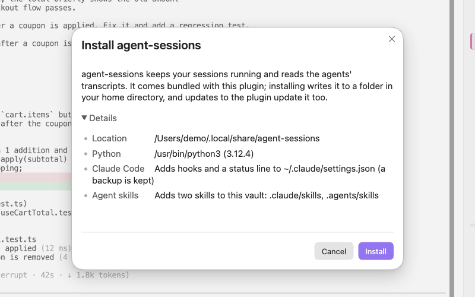

4. Start a real session, switch tabs, rename it, and send a prompt from the built-in editor. Each step is ticked as you do it; **Skip** passes one over. With Codex or OpenCode, only the tab switch is offered.
5. Read about restart, organize and the Session manager.

After an update, the guide shows only setup (when the program is missing) and what's new.

- Closing the guide keeps your place: **Continue the welcome guide** (command palette or settings) resumes it, and **Start the welcome guide from the beginning** runs it again.
- Its pictures load from GitHub while it is open; **Load the guide's pictures from GitHub** turns that off (see [Disclosures](../README.md#disclosures)).
- **Show the welcome guide after updates** stops it reopening after updates.

## Start a session

1. Click **New session** (＋) in the side panel or the Session manager.
2. If more than one agent is enabled, choose the agent.
3. Type a name, optionally as `Category: Name` (see [Name and group sessions](#name-and-group-sessions)).
4. Click **Start**. The session opens in a new tab.

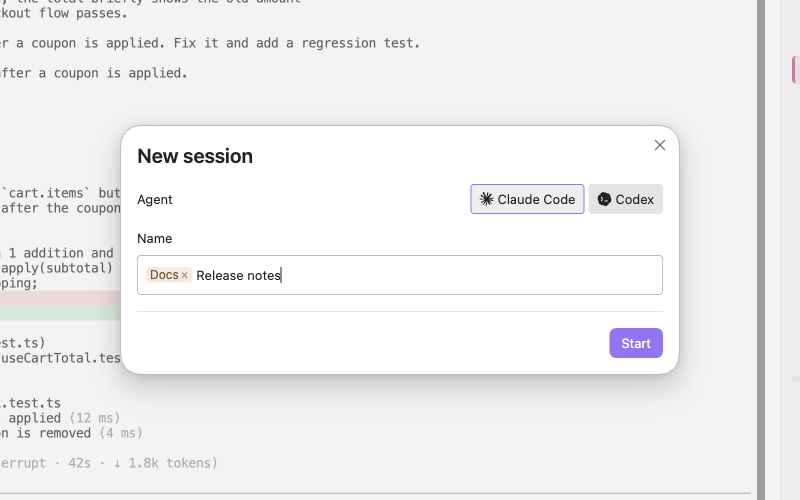

- Agents are detected on first run. Turn each one on or off, and set its path and environment variables, under **Settings → Agents** (see [Settings](#settings)).
- OpenCode can also start through `ollama launch opencode` to use a local model.

## Work in a session tab

Each session is one Obsidian tab running the agent in a terminal.

- **Closing the tab or quitting Obsidian does not end the session.** Reopen it and the last screen is shown again.
- **Paths in the output** that point inside the vault become links.
- **A notice** tells you when a session in another tab finishes or needs an answer.
- **`/clear` in a Claude Code tab** starts a new session in the same tab. The tab follows the new session, the cleared one goes to the Archive, and a named session's new part is named with the next number: `Work: Report` becomes `Work: Report 2`, then `Work: Report 3`. Only a final 2 to 99 counts up: `Plan 2026` becomes `Plan 2026 2`. An unnamed session stays unnamed. `/resume` typed in the tab also moves the tab to that session, without archiving or renaming.
- **`/new` in a Codex or OpenCode tab** (in Codex also `/clear`) works the same way once the new session has its first message: the tab follows it, the earlier one goes to the Archive, and a named session's new part gets the next number. Switching to another session in those tabs (`/resume`, the session list) and `/fork` are not followed: the tab stays on the session it had.

The tab header has these buttons:

| Button | Does |
|---|---|
| **Insert current note with @** | types the open note's path as `@path` |
| **Previous instruction** | jumps to the previous prompt |
| **Next instruction** | jumps to the next prompt |
| **Last response** | jumps to the last response |

Keys inside a session tab:

| Action | macOS | Windows, Linux |
|---|---|---|
| Larger, smaller, reset font | `Cmd +`, `Cmd -`, `Cmd 0` | `Ctrl+Shift+=`, `Ctrl+Shift+-`, `Ctrl+Shift+0` |
| Copy, paste | `Cmd+C`, `Cmd+V` | `Ctrl+Shift+C`, `Ctrl+Shift+V` |
| Copy (Windows) | — | `Ctrl+C` with a selection |
| Paste (Windows) | — | `Ctrl+V` |
| Close the tab | `Cmd+W` | `Ctrl+Shift+W` |
| Command palette | `Cmd+P` | `Ctrl+Shift+P` |

On Windows and Linux, other `Ctrl+<key>` combinations go to the agent, except `Ctrl+Tab` and `Ctrl+,`, which go to Obsidian. On Windows, `Ctrl+C` without a selection interrupts the agent as usual.

`Ctrl+Z` does not leave a session suspended. On macOS and Linux, an agent that suspends itself on `Ctrl+Z` (Claude Code prints "Claude Code has been suspended") is continued at once and redraws its screen; there is no shell to type `fg` in, and none is needed.

## Switch between sessions

- **Side panel:** click a session. Its tab comes to the front, or it opens in a new tab: a running session shows its current screen, and an ended one resumes its conversation.
- **Tabs:** session tabs are ordinary Obsidian tabs. Click one, or use Obsidian's keys for moving between tabs.
- **Session manager:** click a row to see its details, and double-click it or press Enter to open it. The arrow keys move the selection, and `/` jumps to **Filter**.
- **Activity calendar:** click a block, then **Open session**.

## Side panel

The side panel (right sidebar) lists sessions in three groups:

| Group | Holds |
|---|---|
| **Open tabs** | sessions with a tab, including a new one before its first message |
| **Running** | sessions still running without a tab |
| **Recent** | recent sessions |

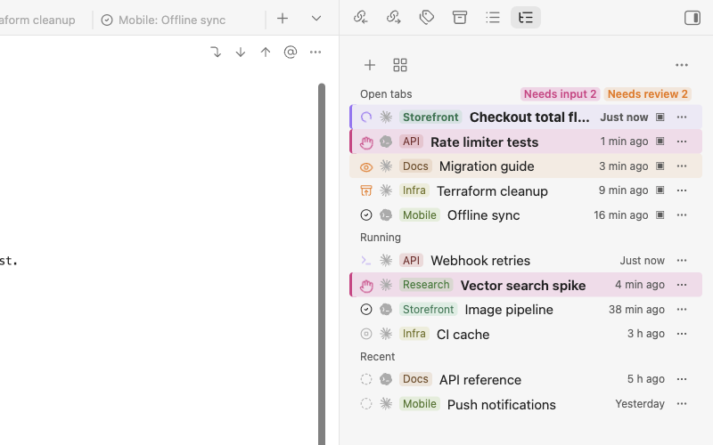

- Each row has a state icon, an agent icon, a category chip and the name.
- The **details pane** below shows the selected session's model, effort, connection status, context usage, total tokens and cost, and the last instruction and reply.
- At the bottom, each enabled agent's 5-hour and 7-day usage bars count down to their reset.

## Session states

The tab, the side panel and the Session manager show the same icon, color and motion for a session's state:

| State | Means |
|---|---|
| **Connecting** | the tab is connecting to the session |
| **Working** | the model is responding |
| **Running a command** | the agent is running a shell command |
| **Waiting for your answer** | a question or permission prompt is open |
| **Waiting for input** | it finished responding and you have not looked at the tab yet |
| **Editing** | the built-in editor is open |
| **Compacted (context was reset)** | `/compact` ran and nothing has been sent to the model since — renaming, changing the model or effort, `/reload-plugins` or ending and resuming the session keep this state |
| **Idle** | nothing is happening |
| **Not connected** | the tab exists but is not connected yet |
| **Exited** | the agent has exited |
| **Error** | an error occurred |

- Animated states respect `prefers-reduced-motion`.
- A small icon next to the state shows the agent (Claude Code, Codex or OpenCode), in one color like the rest of the UI.
- States are grouped into **Needs input**, **Needs review**, **Running**, **Done**, plus **Archived**. The side panel shows the Needs input and Needs review counts, and the Session manager filters by these groups.

A Claude Code session with a `/goal` gets one more icon after its name, in the tab, the side panel and the Session manager. It sits beside the state icon and does not replace it:

| Goal | Icon | Means |
|---|---|---|
| **Goal active** | purple target, breathing slowly while the session works | `/goal` is set and not met yet |
| **Goal met** | green trophy | Claude Code's evaluator found the condition met |
| **Goal judged unreachable** | grey crossed-out flag | the evaluator judged the condition impossible |

- Hover the icon to see the condition and the evaluator's latest reason. The details pane shows both in full (click to expand), with when the goal was set.
- `/goal clear` removes the icon. A new `/goal` replaces the old one.

## Built-in editor

1. In a session, press **Ctrl+G** (the **Editor key** setting: Ctrl+G, Ctrl+Q or Option/Alt+G).
2. Write in the pane under the terminal. It has `@` file completion, autosave, and normal paste, IME and undo. The output stays visible.
3. Press **Send** to submit, or **Back to prompt (Esc)** to return without sending.

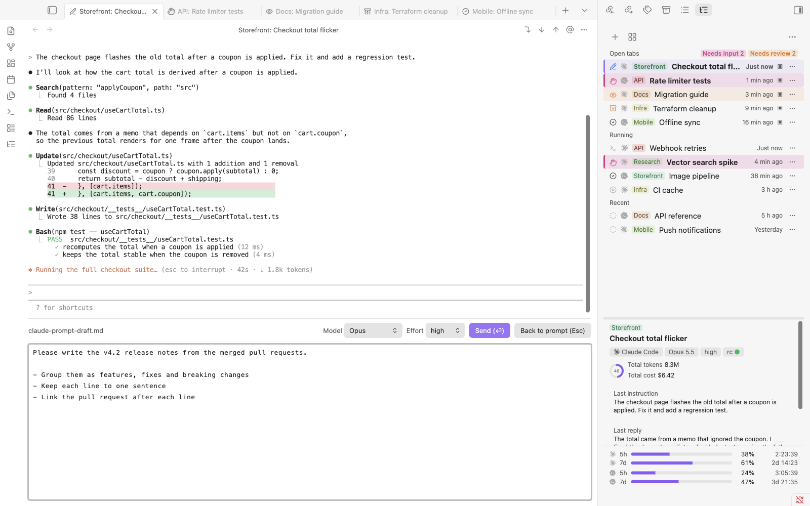

- It also opens for anything the agent hands to an editor, such as `/memory` or `/keybindings`.
- For a Claude Code prompt, the bar has **Model** and **Effort** dropdowns set to the current values. If you change one, **Send** applies it with `/model` and `/effort` before the prompt.
- Each agent is configured to open its editor on the editor key.

## Session menu

Open it with ⋯ on a row, or right-click the row, in the side panel or the Session manager.

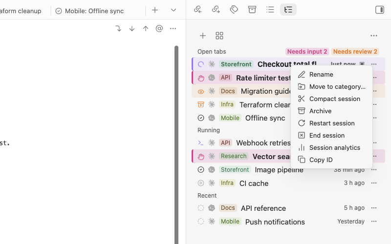

| Item | Does |
|---|---|
| **Rename** | renames the session |
| **Move to category…** | changes its category |
| **Suggest name and category…** | asks an agent for a name and category for this session |
| **Change model…** | switches model and effort (running Claude Code sessions) |
| **Compact session** | sends `/compact` |
| **Restart session** | restarts the agent in the same conversation |
| **Session analytics** | opens the turn-by-turn analysis |
| **Copy ID** | copies the session ID |
| **End session** | ends the agent |
| **Archive** | moves the session to the archive |

## Name and group sessions

Name a session `Category: Name`. Each category gets a stable color and its own group in the Session manager.

- **Rename** has one field, with a dropdown of existing categories; type a new one to create it.
- **Move to category…** changes only the category.

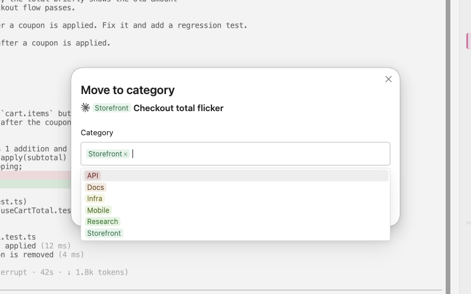

## Organize names and categories

An agent proposes a `Category: Name` for recent sessions from their folder, first prompt, last few prompts and last reply.

1. Open the ⋯ menu of the side panel or the Session manager and choose **Organize names and categories**. For one session, use **Suggest name and category…** in its row menu.
2. The dialog says which agent it will use. Press **Suggest**.
3. Untick a suggestion you don't want, add a comment if you like, and press **Suggest again for unchecked**.
4. Press **Apply selected**. Nothing is renamed before this.

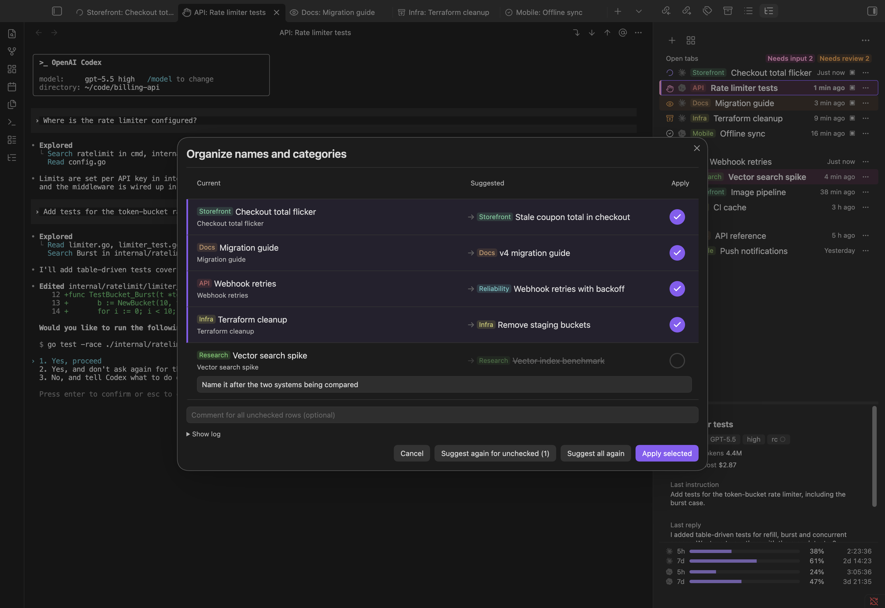

- It covers up to 30 recent sessions that are not archived; by default only those without a name or a category.
- Names are short noun phrases. Categories reuse your existing projects or areas where one fits, and a new one only when none does. Each suggestion has a one-line reason.
- The agent is Claude Code, else Codex, else OpenCode. With Claude Code the model is Sonnet; **Model for suggestions** switches to Haiku, which is faster.
- **Apply selected** renames the same way as **Rename**.
- It sends session excerpts to that agent: see [What Organize sends](../README.md#what-organize-sends).

## Compact, restart and change model

All three are in the session's ⋯ menu (see [Session menu](#session-menu)).

**Compact session** sends `/compact`, the agent's own command that shortens the conversation to free up context. It is greyed out right after a compaction, while the state reads **Compacted (context was reset)**. A session that is not running is started in the background for it, the same way as for **Rename**.

**Restart session** ends the agent and resumes the same conversation in the same tab. Use it after changing settings, hooks, skills or environment.

1. Open the session's ⋯ menu. (Restart is there for running sessions.)
2. Choose **Restart session**. If the session is busy, it asks first.

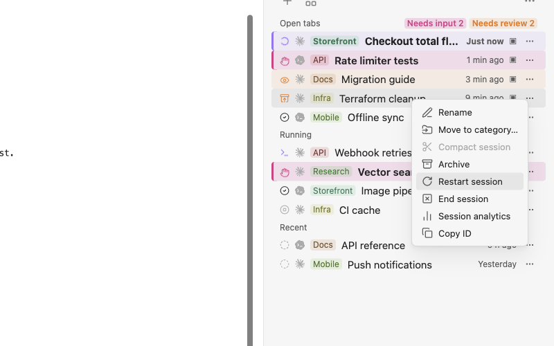

**Change model…** (running Claude Code sessions) picks a model (an alias such as Opus, Sonnet or Haiku, or a full model ID) and an effort level, and sends `/model` and `/effort` for what changed. `/model` also becomes Claude Code's default for new sessions.

## Session analytics

Shows what one session used: cost, tokens, tools and time, for the whole session and for each prompt. Open it with **Session analytics** in the session's ⋯ menu, or **Show session analytics** in the session tab's ⋯ menu.

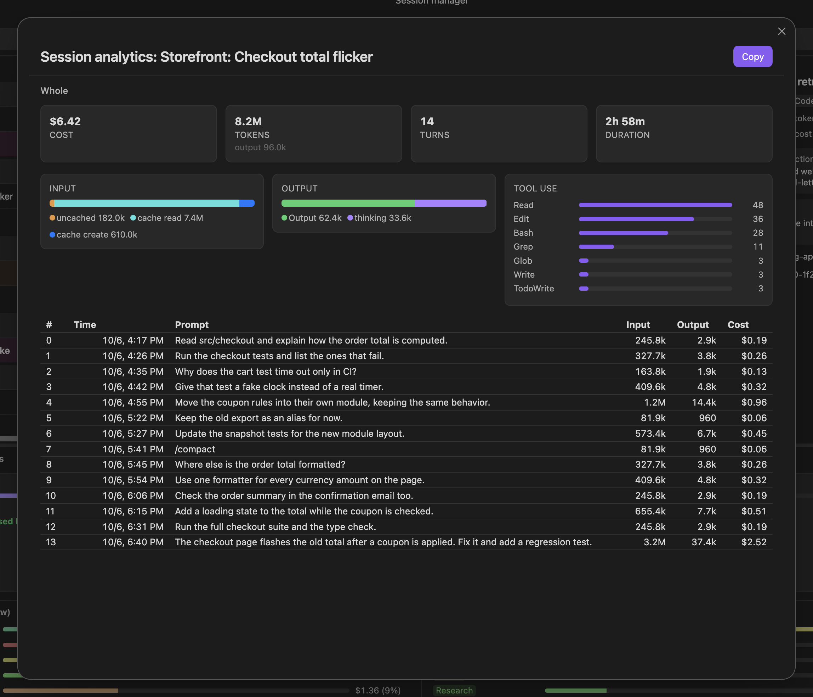

| Part | Shows |
|---|---|
| **Cost** | estimated cost in dollars |
| **Tokens** | input tokens, with output below |
| **Turns** | number of turns |
| **Duration** | first prompt to last reply |
| **Input** | uncached, cache read, cache write |
| **Output** | response and thinking |
| **Tool use** | calls per tool, top 12 |

- A turn is one prompt you sent and everything the agent did until the next one. The table lists each turn's time, prompt (its first 60 characters), input, output and cost. Usage before the first prompt is a row of its own, **(Before first prompt)**, and counts as a turn.
- Input counts every token the model read: new (uncached) tokens, tokens read from the prompt cache, and tokens written to it. The cache read is usually most of it.
- Claude Code and Codex costs are calculated from the token counts and each model's price; OpenCode's are the cost OpenCode records. **estimated** under the cost means a Claude model in the range has no price in the plugin's list, so it was priced like Claude Opus 5. A reply with no price at all (a Codex model not in that list, or an OpenCode reply without a recorded cost) is left out of the cost, which then reads like `$1.20+`, or `—` when no reply has a price. **N without a price** under the cost card, and the tooltip on any cost marked this way, say how many replies are left out. The Session manager's costs and the details pane mark them the same way.
- The numbers come from the agent's own files, read once when the dialog opens. Open it again to update them.

To look at part of a session:

1. Click the first turn of the part. The line above the cards reads "#3– (click the end row)".
2. Click the last turn. The cards and bars now count only those turns, and the line reads "#3–#7".
3. Press **Whole** to go back to the whole session. Clicking the first turn again before choosing the last does the same.

**Copy** copies the cards and the rows in the current range as Markdown.

## Session manager

The Session manager is what a new empty tab shows. It also opens from **Session manager** in the side panel and the command palette. Opening it never starts a session.

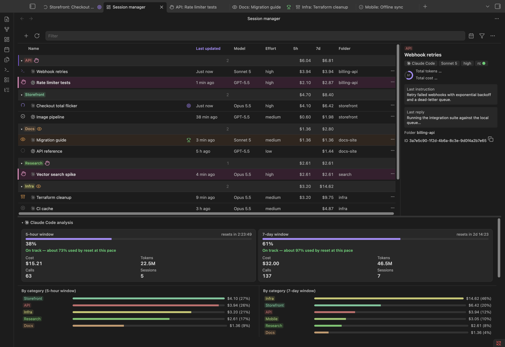

- **Session list.** Sessions grouped by category, plus an "Other" group and the archive. The table sorts by **Last updated**, model, effort, 5h and 7d cost, and folder.
- **Status filter** (toolbar): All, Needs input, Needs review, Running, Done, Archived.
- **Opening a session.** Double-click a row or press Enter (see [Switch between sessions](#switch-between-sessions)).
- **Analysis** (below, collapsible and resizable): 5-hour and 7-day cards with the time to reset, a weekly-pace forecast ("on track", or when it will run out), and cost by category. With more than one agent enabled, there is one section per agent.

## Activity calendar

Shows when each agent was working. Open it from the Session manager toolbar, the side panel's ⋯ menu, or the command palette (**Open activity calendar**).

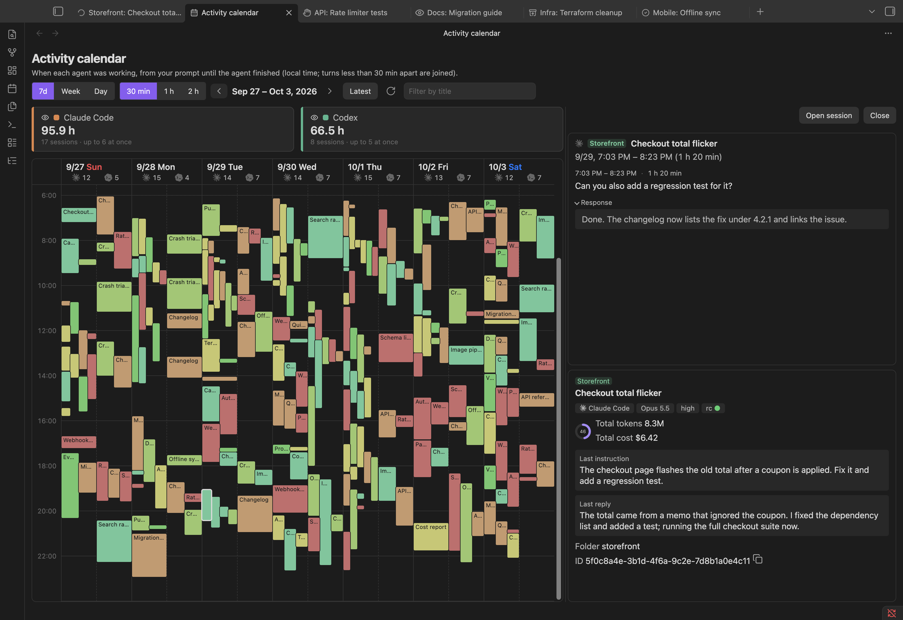

| Mode | Shows |
|---|---|
| **7d** (default) | 7 days aligned to your usage limit's reset |
| **Week** | Sunday to Saturday, local time |
| **Day** | one day, 0:00 to 24:00 |

- **7d** follows Claude Code's 7-day window if Claude Code is enabled and its reset is known, else Codex's weekly window, else a week from Sunday. Earlier periods step back 7 days.
- In Day mode each session gets its own column instead of one lane per agent.
- The arrows move one period and stop at the current one; **Latest** returns to it. The mode is remembered. Click a date to open that day.

**Reading a block**

- A block runs from your input to the agent's last output before your next input. Your input is what you typed (a slash command too) or your answer to the agent's question. Notifications, reminders and messages from other sessions do not start a turn.
- Time sub-agents (background agents, teammates) spend working counts too.
- A pause of 30 minutes or more inside a turn is not counted.
- Turns less than 30 minutes apart join into one block. The **30 min / 1 h / 2 h** control changes this gap; the line under the title states the current one.
- A block under a minute shows as one minute and is always a few pixels tall. Overlapping sessions sit side by side.
- Sessions keep one left-to-right order everywhere: the session that started first is on the left, in every hour, every day, and in Day mode's columns. Changing the gap, the filter or the agents shown doesn't reorder them.
- The calendar shows the sessions the Session manager lists: archived sessions and unnamed child sessions started by other sessions are left out.

**Working with it**

- Hover a block for its time range and name.
- Click a block to open a details panel on the right (drag the divider to resize; **Close** to go back). It lists each of your turns in the block: when, how long, what you asked or answered, and the final reply under **Response**. Below are the session's details and **Open session**.
- Each agent's summary card (hours, sessions, peak concurrency) is also its show/hide switch. At least one agent stays on, and the choice is remembered.
- **Filter by title** narrows the blocks.
- A line marks the current time in today's column.
- The calendar reloads while it is showing: when you come back to its tab, a few seconds after a session finishes a turn, and every minute while the period includes now. It keeps your place and the open details.

## Usage and limits

- Each agent's account-wide 5-hour and 7-day windows, with the countdown to reset and a weekly-pace forecast, in the side panel and the Session manager.
- A window whose limit has been reached reads 100% in red, and says when it ran out and how long before its reset ("Used up 3:26 PM (2h 12m before reset)").
- One session's cost, tokens and tools, turn by turn: [Session analytics](#session-analytics).
- They come from each agent's own local files.

## Token efficiency

Shows where your recent tokens could be saved, why they were spent, and what to change, from your local records.

1. In the Session manager, open the ⋯ menu and choose **Analyze token efficiency**, or run **Analyze token efficiency** from the command palette.
2. The dialog reads the records on this machine (nothing is sent) and shows the range, the totals, where the tokens went, and the findings the statistics found on their own (marked **From the statistics**).
3. To have the agent look into causes and remedies, read its pane (where the excerpts go, how much, and the window's usage), open **Show what is sent** if you like, and press **Analyze**. **Cancel** stops it; the statistics' findings stay.
4. On a finding that a file or setting can fix, press **Ask an agent to fix**, check or edit the request, and press **Start**.

What the dialog shows:

- **The range line**: which recent stretch was analysed. If the 5-hour or 7-day window is used at least as much as **Usage limit threshold**, that window; otherwise the newest calls up to the **Budget** in weighted tokens, and at least the last 24 hours, at most 7 days back. The line says which decided: "the last N hours, up to … weighted tokens", "the last 24 hours (at least a day; … were reached sooner)" or "the last 7 days (… not reached)". Then the session count and the tokens.
- **Weighted tokens**: input, plus cache writes at 1.25 (five minutes) or 2 (one hour), cache reads at 0.1, and output at 5, so different usage compares on one scale.
- **Where the tokens went**: each call counted once, under the finding that costs it the most; teammates under **Team**, the rest under **Other**.
- **A finding**: its impact (weighted tokens, dollars when known, share of the range), the estimated saving, the confidence, the cause, the evidence (open it to see the sessions, with **Open** links, and quotes), and what to do.
- **Candidates**: mixed topics in one conversation and correction round trips are found from timing and edits only; they become findings only after **Analyze** confirms them.
- **The analysis's cost**: shown under the findings; it counts toward that agent's usage limits.
- **Previous analysis**: the last result is kept and shown when you open the dialog again for an overlapping range; **This is the same content as the previous analysis** means sending again would send the same text.

What the findings ask of you:

- **Ask an agent to fix** starts a new session in the vault, named "Token efficiency: …", in plan mode. It shows the change as a diff and waits for your approval before writing; only the listed files may change. The change applies to conversations started afterwards.
- Advice about habits (when to start a new conversation, which model to use, how to write a request) has no button. To switch to a new conversation, open a new tab. **Copy template** copies a request outline (target, expected result, how to check, what not to touch).
- If the records are too few (under 100 prompts in 14 days), some checks are skipped and the dialog says so.
- What is sent, and where: see [What Token efficiency sends](../README.md#what-token-efficiency-sends).

## Agent skills

Two skills are installed with the program, into the vault only:

| Skill | Lets an agent |
|---|---|
| `agent-sessions` | read usage and session details, list sessions, and start one when you ask |
| `agent-sessions-help` | answer questions about using the plugin |

- `agent-sessions` works from a Claude Code, Codex or OpenCode session started in the vault. It reads the 5-hour and 7-day windows and a session's tokens and cost, lists other sessions with their status and last messages, and starts a new session only when you ask (in a folder, with a name, on any enabled agent; Claude Code optionally with Remote Control).
- `agent-sessions-help` answers in the language you ask in: where something is, how to rename, organize or restart, how to use the built-in editor, what is supported.

## Remote Control

A Claude Code session with Remote Control (started with it, or with "Enable Remote Control for all sessions" on in Claude Code's `/config`) shows the same name in Remote Control (claude.ai and the Claude app) as in Agent Sessions:

- A session named when you create it starts with that name, so its Remote Control session is created under it.
- Renaming a session sends `/rename`, which renames its Remote Control session too. For a session that is not running, Agent Sessions starts it in the background, waits for Remote Control to connect, renames it and ends it again.
- When a named session is resumed (opened again after it ended, or restarted) and Remote Control connects, Agent Sessions sends `/rename` with its current name once. Claude Code reconnects to the earlier Remote Control session without passing on a name changed while it was not connected, so this brings the two back together. The session shows one "Session renamed" line each time.

## Settings

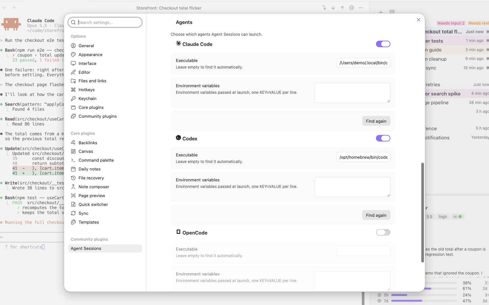

| Setting | Values |
|---|---|
| **Font**, **Font size** | terminal font |
| **Padding** | Comfortable, Compact, None |
| **Submit key** | Enter by default |
| **Editor key** | Ctrl+G, Ctrl+Q, Option/Alt+G |
| **Recent count (side panel)** | number of recent sessions |
| **Notify when waiting for input** | on, off |
| **Agents** | per agent: on/off, **Executable**, **Environment variables**, **Find again** |
| **Launch with** (OpenCode) | `opencode` or `ollama launch opencode` |
| **Ollama model** (OpenCode) | from `ollama list`, or typed |
| **agent-sessions location** | path |
| **Scrollback lines** | terminal history |
| **Editor pane height (%)** | built-in editor height |
| **Model for suggestions** | Sonnet, Haiku |
| **Usage limit threshold** (Token efficiency) | 50–95%, 80 by default |
| **Budget** (Token efficiency) | 1,000,000–100,000,000 weighted tokens, 10,000,000 by default |
| **Model for the analysis** (Token efficiency) | Sonnet, Opus |
| **Language** | Auto, English, 日本語 |
| **Show the welcome guide after updates** | on, off |
| **Load the guide's pictures from GitHub** | on, off |

- **Language: Auto** follows Obsidian's own language.
- **agent-sessions location** left empty uses `~/bin/agent-sessions` if it exists, else the copy installed from the plugin.
- The heights of the side panel's details pane and the Session manager's analysis panel are saved as you drag them.
- With OpenCode on, a status line row in OpenCode's session screen shows the submit-key symbol and whether the session is busy, idle or waiting. There is nothing to configure.

## CLI

```sh
agent-sessions                 # terminal UI: pick a session, attach or resume it
agent-sessions attach ID       # attach from a terminal (Ctrl+\ to detach)
agent-sessions daemon [--detach]
agent-sessions json scan|live|detail ID|usage ID [--from ISO --to ISO]|stats
agent-sessions setup [--dry-run]
agent-sessions setup --opencode   # install OpenCode's status plugin and status line only (--remove-opencode: remove just those files and restore the tui.json keybinds)
agent-sessions setup --skills     # install the agent skills into the vault (--remove-skills: remove just those)
agent-sessions new [--agent A] [--cwd DIR] [--name N] [--remote-control] [--prompt TEXT]   # start a session in the daemon (exit 0 confirmed, 1 unconfirmed, 2 failed)
agent-sessions sessions [--query TEXT] [--agent A] [--limit N] [--json]   # list sessions with their status
agent-sessions show [ID|NAME] [--json]   # one session's usage and last messages (default: this session)
agent-sessions stats [--json]     # 5-hour/7-day usage windows per agent
```

- `json`, `hook`, `status` and `edit` are the interfaces the plugin and the agents use.
- On Windows, the terminal UI (`agent-sessions` with no arguments) and `agent-sessions attach` are not available (they need `curses` and `termios`). The other commands, the built-in editor included, work.

## More troubleshooting

- **A Claude Code hook fails with something like `node: not found`** (often another plugin's hook script). Node is probably installed through a version manager (mise, nvm, asdf, volta) that loads only in an interactive shell (`.zshrc`, `.bashrc`). The plugin also reads an interactive shell's `PATH`, so the next session should work. If not, check in a terminal that `$SHELL -i -c 'echo $PATH'` includes node's folder.
- **The program cannot be installed on Windows (Python or Claude Code not found).** The install dialog offers **Install Python with WinGet** and **Install Claude Code with WinGet**; each runs `winget install` per user, without an administrator prompt, when you click it. If the dialog says WinGet is missing, update "App Installer" from the Microsoft Store. A `python.exe` that is only the Microsoft Store's empty alias is not used; install Python with WinGet or from python.org.
- **Codex or OpenCode on Windows is not found.** Install it with npm (`npm install -g @openai/codex`, `npm install -g opencode-ai`) or as an `.exe` (WinGet, Scoop, Chocolatey), then press **Find again** in its settings block. A folder outside `PATH` can be set as the agent's executable path (for example `%APPDATA%\npm\codex.cmd`).
- **Windows on ARM: an OpenCode tab stops at `bun:ffi dlopen() is not available in this build (TinyCC is disabled)`.** OpenCode's ARM64 build (the one WinGet installs on Windows on ARM) cannot start its terminal UI; this is OpenCode's own limitation. Install OpenCode's x64 build instead, which Windows runs under emulation.
- **An agent in WSL, Obsidian on Windows.** Not supported (see [Supported environments](../README.md#supported-environments)). Run Obsidian in WSL through WSLg.
